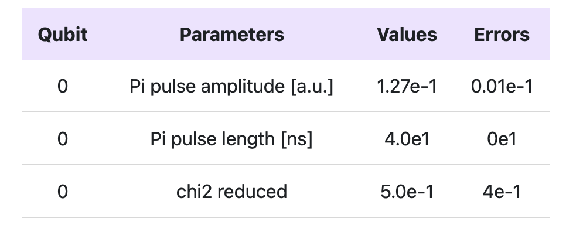

# Qibocal
[](https://codecov.io/gh/qiboteam/qibocal)


Qibocal provides calibration protocols using [Qibo](https://github.com/qiboteam/qibo) and [Qibolab](https://github.com/qiboteam/qibolab).

Qibocal key features:

- Declarative inputs using runcard.

- Generation of a report.

## Documentation

[](https://qibo.science/qibocal/stable/)

Qibocal documentation is available [here](https://qibo.science/qibocal/stable/).

>[!NOTE]
> Qibocal `main` contains some breaking changes compared to `0.1` versions.
> A small guide to make the transition as smooth as possible can be found [`here`](changes.md).

## Installation

The package can be installed by source:
```sh
git clone https://github.com/qiboteam/qibocal.git
cd qibocal
pip install .
```


### Developer instructions
For development make sure to install the package using [`poetry`](https://python-poetry.org/) and to install the pre-commit hooks:
```sh
git clone https://github.com/qiboteam/qibocal.git
cd qibocal
poetry install
pre-commit install
```

## Minimal working example

Here is an example on how to run a Rabi experiment in Qibocal.

```py
from qibocal import create_calibration_platform
from qibocal.protocols import rabi_amplitude

# create platform
platform = create_calibration_platform("qubit")

# define qubits where the protocols will be executed
targets = [0]

# define protocol parameters
params = rabi_amplitude.parameters_type.load(dict(
        min_amp=0.01,
        max_amp=0.2,
        step_amp=0.02,
        nshots=2000,
        pulse_length=40,
        ))

# acquire
platform.connect()
data, acquisition_time = rabi_amplitude.acquisition(
                                                    params=params,
                                                    platform=platform,
                                                    targets=targets
                                                    )
platform.disconnect()

# post-processing
results, fit_time = rabi_amplitude.fit(data=data)

# visualize the results
plots, table = rabi_amplitude.report(data=data, results=results, target=target[0])
plots[0].show()
```

<p align="center">
  
</p>

The table is written in HTML and can be visualized in Python with

```py
from IPython import display
display.HTML(table)
```
<p align="center">
  
</p>


### Running a protocol through a runcard

The same experiment can also be run using the following yaml file

```yaml
platform: qubit
targets: [0]
actions:
- id: rabi
  operation: rabi_amplitude
  parameters:
    min_amp: 0.01
    max_amp: 0.2
    step_amp: 0.02
    nshots: 2000
    pulse_length: 40
```
To run the protocol Qibocal uses the `qq run` command
```sh
qq run <runcard> -o <output_folder>
```
if ```<output_folder>``` is specified, the results will be saved in it, otherwise ```qq``` will automatically create a default folder containing the current date and the username.


### Uploading reports to server

In order to upload the report to a centralized server, send to the server administrators your public ssh key (from the machine(s) you are planning to upload the report) and then use the `qq upload <output_folder>` command. This program will upload your report to the server and generate an unique URL.

## Contributing

Contributions, issues and feature requests are welcome!
Feel free to check
<a href="https://github.com/qiboteam/qibocal/issues"></a>

## Citation policy
[](https://arxiv.org/abs/2303.10397)
[](https://zenodo.org/badge/latestdoi/511836317)


If you use the package please refer to [the documentation](https://qibo.science/qibo/stable/appendix/citing-qibo.html#publications) for citation instructions

## Ongoing development

A non-exhaustive list of possible protocols to be implemented in Qibocal is collected
[here](doc/dev/README.md).
