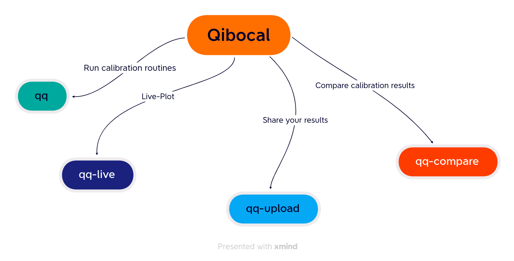
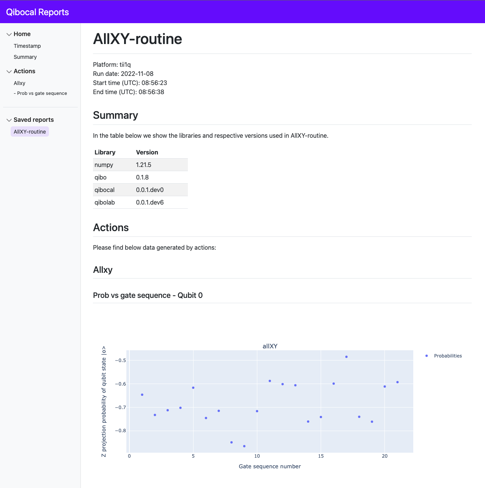

How to use Qibocal?
===================

In this section we present the different commands implemented in ``qibocal`` and how to use them.

``qq``
^^^^^^

``qq`` is the base command in ``qibocal``. It can be launched from the command line using:

.. code-block::

    qq <path_to_runcard>

where ``<path_to_runcard>`` is the relative path to runcard, a yaml file containing all the instructions
required to execute ``qq``. The runcard layout is specified in the :ref:`this <runcard>` section.

``qq`` will create a folder, in the same directory where the command was executed, with a default name
``YYYY-MM-DD-xxx-username`` where ``xyz`` are three integers starting from ``000`` and ``username`` is the name of the user that
is launching the job on the QRC cluster. If a folder with the same name already exists the program will try to create folder where the combination ``xyz``
is incremented by 1, until a new folder is created.

There is also the option to specify the name of the output folder through the ``-o`` option.

.. code-block::

    qq <path_to_runcard> -o <output_folder>

It is possible to overwrite an existing folder using the option ``-f``.

Inside the folder generated by ``qq`` you will find the following

* ``platform.yml``: a yaml containing the platform runcard used at the beginning of the calibration;
* ``new_platform.yml``: a yaml containing the updated platform runcard after running the calibration routines specified in the runcard;
* ``runcard.yml``: a copy of the runcard provided when executing ``qq``;
* ``index.html``: web page where reports are displayed;
*  ``data``: folder containing all the results divided by routines.

.. _qqlive:

``qq-live``
^^^^^^^^^^^

``qq-live`` is the command dedicated to live-plotting. It can be launched from the command line using:

.. code-block::

    qq-live

``qq-live`` will start a flask server in local mode. By opening the correspoding web page you will see
a list with all the folders generated by ``qq`` in the directory where ``qq-live`` is executed.
If you select one of them you will see the page generated by ``qq``.

If you are opening an output folder which is currently being generated by ``qq``, you will
see live-updates as the calibration routines is executed on the quantum computer.

You can directly select the port to serve the application using the ``-p`` option.
For example in order to start the server on the port 8055 you can type.

.. code-block::

    qq-live -p 8055

It is possible to start the flask server in debug mode using the option ``-d``.

The following picture shows an example of the generated web page:

``qq-upload``
^^^^^^^^^^^^^

Using ``qq-upload`` it is possible to upload the output folder generated by ``qq`` on this
`web page <http://login.qrccluster.com:9000/>`_

.. code-block::

    qq-upload <output_folder>

In the web page it is possible to visualize all reports uploaded by other users.
