How to use Qibocal?
===================

In this section we present the different commands implemented in ``Qibocal`` and how to use them.

``qq acquire``
^^^^^^^^^^^^^^

``qq acquire`` is used to perform the data acquisition for each protocol. You can execute the ``qq acquire`` command
using the following syntax:

.. code-block::

    qq acquire <path_to_runcard>

where ``<path_to_runcard>`` is the relative path to runcard, a yaml file containing all the instructions
required to execute a set of protocols. The runcard layout is specified in the :ref:`this <runcard>` section.

The data will be collected in an output folder, in the same directory where the command was executed, with a default name
``YYYY-MM-DD-xxx-username`` where ``xyz`` are three integers starting from ``000`` and ``username`` is the name of the user that
is launching. If a folder with the same name already exists the program will try to create folder where the combination ``xyz``
is incremented by 1, until a new folder is created.

There is also the option to specify the name of the output folder through the ``-o`` option.

.. code-block::

    qq acquire <path_to_runcard> -o <output_folder>

It is possible to overwrite an existing folder using the option ``-f``.

``qq fit``
^^^^^^^^^^

This command is used to perform a post-processing analysis on a given output folder generated by ``qq acquire``.

.. code-block::

    qq fit <output_folder>

``qq report``
^^^^^^^^^^^^^

This command produces an ``index.html`` file inside the output folder which contains a report with all the information
regarding the protocols executed.

.. code-block::

    qq report <output_folder>

``qq auto``
^^^^^^^^^^^

The previous commands are put together using ``qq auto`` which will perform data acquisition, post-processing and report generation.
When executing multiple protocols they are executed following the graph described in the action runcard.
The report is generated iteratively as soon as each protocol finished.

.. code-block::

    qq auto <path_to_runcard> -o <output_folder>

``qq upload``
^^^^^^^^^^^^^

Using ``qq upload`` it is possible to upload the output folder generated by ``qq`` on this
`web page <http://login.qrccluster.com:9000/>`_, which collects all reports uploaded
by other users as well.

.. code-block::

    qq upload <output_folder>
