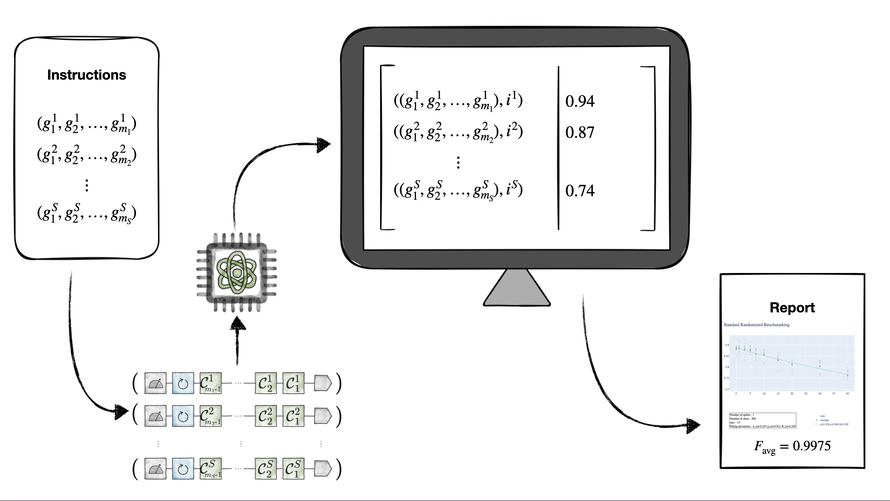
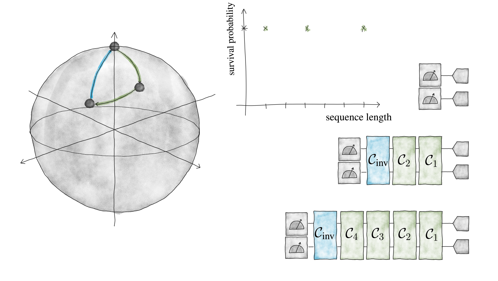
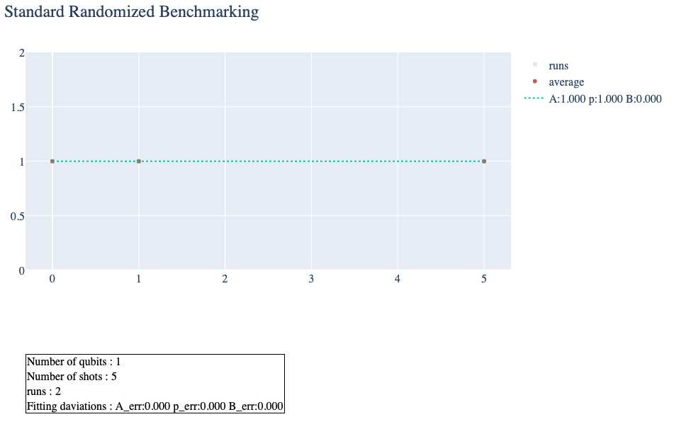

=========================================
Non-Interactive Gate Set Characterization
=========================================

``qibocal`` offers a seamless and efficient solution for implementing non-interactive Gate Set Characterization (niGSC) protocols.
An abstract level explanation of the architecture is depicted in the figure below.

In ``abstract.py``, see section :ref:`abstract-module-label` of the APIs documentation,
the overall structure is set up.
The foundation is three classes:

    1. The circuit factory, an iterator which produces circuits when called.
    2. The Experiment class which takes an iterable object producing circuits, optional some parameters. It is able to execute the circuits and to overwrite/store/process the necessary data.
    3. A class storing and displaying the results of a gate set characterization.

A gate set characterization protocol will be demonstrated with a standard randomized benchmarking scheme.

Standard Randomized Benchmarking
================================

In general, the idea of a standard RB protocol is to quantify the performance of a quantum device
regarding the implementation of gates.
For that the quantum device needs to be able to prepare a quantum state, modify this quantum state with gates,
and in the end measure the outcome of the modulation of the quantum state.
The survival probability of the ground state :math:`y(m)` dependent on the sequence length
of the applied gates :math:`m`, is modulated with the following exponential function:

.. math::
    y_{\text{fit}}(m) = Ap^m+B,

where :math:`A, B` are SPAM (state preparation and measurement)-error constants  absorbing the state preparation and measurement error.
The base of the exponent :math:`p` is used to calculate the average gate fidelity :math:`F` as

.. math::
    F = 1-\frac{d-1}{d}(1-p),

which in the end is the reported value for the quantum device which is being benchmarked.

In the Figure below on the left a Block sphere is shown with two gates (in green) acting on the initial state
depicted as a grey bullet on top of the sphere. A final inverse gate (in blue) redoes the sequence and
in an ideal case should bring the state back to the inital state.
Standard RB normally is performed with Clifford gates :math:`\mathcal{C}`.
On the very right a schematic explanation of different sequence lengths is shown.
The triangles stand for state preparation, the green boxes for Clifford gates, the blue boxes for
the inverse gate and the boxes to the very left in the scheme are measurements.
Between the sphere and the boxes a sketch of how the survival probabilities should behave
is shown. Since there are no error gates the survival probability stays at one.

A gate independent error :math:`\Lambda` acting with every applied gate on the quantum state
is a good first approximation as error model.
There are more general models, they will be explored in a different tutorial.
In the Figure below general depolarizing channels are linked between the Clifford gates making
the signal drop exponentially.
The above defined fitting function can then be used to calculate the average gate fidelity.

.. image:: images/StandardRB_error.png
  :width: 700
  :alt: Error Bloch sphere next to an image depicting the survival probability vs sequence length next to an image of state preparation + unitary manipulation + measurements

Qibocal Implementation
^^^^^^^^^^^^^^^^^^^^^^

First define the necessary variables which will be used when initiating the
circuit factory and the experiment object.

.. code-block:: python

    # Define the necessary variables.
    nqubits = 1 # Number of qubits in the quantum hardware.
    depths = [0,1,5] # How many random gates there are in each circuit.
    runs = 2 # The amount of repetitions of the whole experiment.
    nshots = 5 # When a circuit is executed how many shots are used.

The circuit factory
"""""""""""""""""""

Now build the circuit factory, and check out how it works.

.. code-block:: python

    from qibocal.calibrations.niGSC import standardrb
    # To not alter the iterator when using it, make deep copies.
    from copy import deepcopy
    factory = standardrb.ModuleFactory(nqubits, depths * runs)
    # ``factory`` is an iterator class object generating single clifford
    # gates with the last gate always the inverse of the whole gate sequence.
    # There are mainly three ways how to extract the circuits.
    # 1. Make a list out of the iterator object.
    circuits_list1 = list(deepcopy(factory))
    # 2. Use a for loop.
    circuits_list2 = []
    for circuit in deepcopy(factory):
        circuits_list2.append(circuit)
    # 3. Make an iterator and extract the circuits with the next method.
    iter_factory = iter(deepcopy(factory))
    circuits_list3, iterate = [], True
    while iterate:
        try:
            circuits_list3.append(next(iter_factory))
        except StopIteration:
            iterate = False
    # All the three lists have circuits constructed with
    # single clifford gates according to the ``depths``list,
    # repeated ``runs``many times.

The experiment
""""""""""""""

.. code-block:: python

    # Initiate the standard RB experiment. To make it simpler
    # first without simulated noise on the circuits.
    experiment = standardrb.ModuleExperiment(factory, nshots=nshots)
    # Nothing happened yet. The experiment has to be executed
    # to execute the single circuits and store the samples along
    # with the number of applied gates.
    experiment.perform(experiment.execute)
    # Check out the data in a data frame. Since there is no noise all
    # the samples from the measured qubits were in the ground state.
    print(experiment.dataframe)
    #                     samples  depth
    # 0  [[0], [0], [0], [0], [0]]      0
    # 1  [[0], [0], [0], [0], [0]]      1
    # 2  [[0], [0], [0], [0], [0]]      5
    # 3  [[0], [0], [0], [0], [0]]      0
    # 4  [[0], [0], [0], [0], [0]]      1
    # 5  [[0], [0], [0], [0], [0]]      5

The postprocessing
""""""""""""""""""

The standard randomized benchmarking protocol aims at analyzing the probability
of the state coming back to the inital state when inversing all the gates applied gates.
Since normally the initial state is the grounds state :math:`\ket{0}` the survival
of the ground state probability has to be analyzed.
And with analyzed it is meant to extract the probabilities for every sequence (or depth)
of each run, average over the runs, fit an exponential decay to the signal and use the
base of the exponent to calculate the average gate fidelity.

.. code-block:: python

    # Make the experiment calculate its own ground state probability,
    # it will be appended to the data.
    standardrb.post_processing_sequential(experiment)
    # Now the data attribute of the experiment object has all its needs
    # for the desired signal (ground state survival probability) to
    # be fitted and plotted. It only has to be aggregated.
    df_aggr = standardrb.get_aggregational_data(experiment)
    # The build_report functions knows how to plot the aggregated data along
    # with the sequential data and returns the report figure.
    fig = standardrb.build_report(experiment, df_aggr)
    fig.show()

When simulating the standard RB scheme noise can be added using the qibo.noise module.
It has to be predefined and passed when initiating the experiment object.

.. code-block:: python

    # To not alter the iterator when using it, make deep copies.
    from qibocal.calibrations.niGSC import standardrb
    from qibocal.calibrations.niGSC.basics.noisemodels import PauliErrorOnUnitary

    nqubits = 1
    runs = 10
    depths = [0, 1, 5, 10, 15]
    nshots = 128
    # Define the noise model used in the simulation.
    noisemodel = PauliErrorOnUnitary(0.01, 0.02, 0.04)
    factory = standardrb.ModuleFactory(nqubits, depths * runs)
    # Add the noise model to the experiment.
    experiment = standardrb.ModuleExperiment(factory, nshots=nshots, noise_model=noisemodel)
    experiment.perform(experiment.execute)
    experiment.perform(standardrb.groundstate_probabilities)
    df_aggr = standardrb.get_aggregational_data(experiment)
    fig = standardrb.build_report(experiment, df_aggr)
    fig.show()

.. image:: images/Example_standardRBerror_report.png
  :width: 600
  :alt: Screenshot of Report when executing the code from above
