.. title::
      Qibocal

What is Qibocal?
================

Qibocal is a python module that implements Quantum Characterization Validation and Verification using
`Qibo <https://github.com/qiboteam/qibo>`_ and `Qibolab <https://github.com/qiboteam/qibolab>`_.

Protocols
---------

Here is a scheme with the protocols currently available in Qibocal:

Key features
------------

* Automatization of calibration routines.
* Declarative inputs using runcard.
* Generation of a report.

How to Use the Documentation
============================

Welcome to the comprehensive documentation for Qibocal! This guide will help you navigate through the various sections and make the most of the resources available.

1. **Installation and Setup**: Begin by referring to the :doc:`/getting-started/installation` guide to set up the Qibocal library in your environment.

2. **Tutorials**: Explore the :doc:`/tutorials/index` section for a range of tutorials that cater to different levels of expertise. These tutorials cover basic examples, real experiments, and guides for extending the library with new instruments.

3. **API Reference**: For an in-depth exploration, visit the :doc:`/api-reference/qibocal` section. Here, you'll find automatically compiled documentation generated from present docstrings. This reference offers comprehensive insights into the various classes, methods, and attributes available within the library.

Contents
========

.. toctree::
    :maxdepth: 2
    :caption: Introduction

    getting-started/index

.. toctree::
    :maxdepth: 2
    :caption: Tutorials

    tutorials/index

.. toctree::
    :maxdepth: 2
    :caption: Main documentation

    api-reference/modules
    Developer guides <https://qibo.science/qibo/stable/developer-guides/index.html>

.. toctree::
    :maxdepth: 1
    :caption: Documentation links

    Qibo docs <https://qibo.science/qibo/stable/>
    Qibolab docs <https://qibo.science/qibolab/stable/>
    Qibocal docs <https://qibo.science/qibocal/stable/>
    Qibosoq docs <https://qibo.science/qibosoq/stable/>

Indices and tables
==================

* :ref:`genindex`
* :ref:`search`
