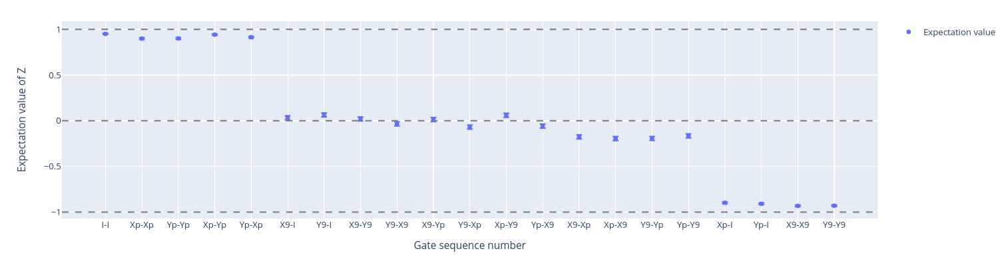

All-XY
======

The All-XY experiment is commonly used to evaluate the quality of the single qubit rotations :cite:p:`gao2021practical`. In this protocol, a sequence
of single qubit rotations pairs are performed, such that the resulting states form a staircase pattern where only :math:`\ket{0}`,
:math:`\ket{1}` or a superposition of the two are present.

Example
^^^^^^^
It follows a runcard example of this experiment.

.. code-block:: yaml

    - id: allxy
      operation: allxy
      parameters:
        nshots: 2000

A detailed explanation of the parameters can be found in :class:`qibocal.protocols.allxy`.

The expected output is the following:

