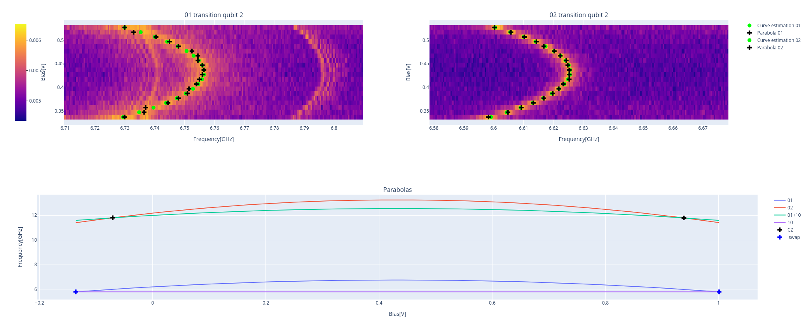

Avoided crossing
================

In the avoided crossing experiment the goal is to study the qubit-flux dependency 
of a couple of qubits to precisely tune the interaction between them at specific
frequencies in order to calibrate the CZ and the iSWAP gates. 

In the avoided crossing experiment for CZ qubit gates, the interaction between 
two qubits is controlled by tuning their energy levels such that the :math:`\ket{11}`
(both qubits in the excited state) and :math:`\ket{02}` (one qubit in the ground state and 
the other in the second excited state) states come into resonance. 
At this resonance point, the energy levels of these states experience an avoided 
crossing, a key phenomenon that enables the controlled-Z (CZ) gate operation. 
By observing the avoided crossing, one can confirm that the coupling between the 
qubits is strong enough to facilitate the necessary interaction for the CZ gate. 
Hence, precise tuning of these states is essential for achieving the correct gate 
operation.

In the avoided crossing experiment for iSWAP qubit gates, the key focus is on 
the interaction between the :math:`\ket{10}` and :math:`\ket{01}` states.
When tuning the qubits' energy levels, these two states come into resonance,
creating an avoided crossing, which is the fundamental operation of 
the iSWAP gate. 

In this protocol, for each qubit pair we execute a qubit flux dependency of the
01 and 02 transitions on the qubit with higher frequency and we fit the data to 
find the flux-frequency relationship that we use to estimate the bias needed to
reach the CZ and iSWAP interaction points. 

Parameters
^^^^^^^^^^

.. autoclass::
	qibocal.protocols.flux_dependence.avoided_crossing.AvoidedCrossingParameters
	:noindex:

Example
^^^^^^^

It follows a runcard example of this experiment.

.. code-block:: yaml

    - id: avoided crossing
      operation: avoided_crossing
      parameters:
        bias_step: 0.01
        bias_width: 0.2
        drive_amplitude: 0.5
        freq_step: 500000
        freq_width: 100000000

The expected output is the following:

