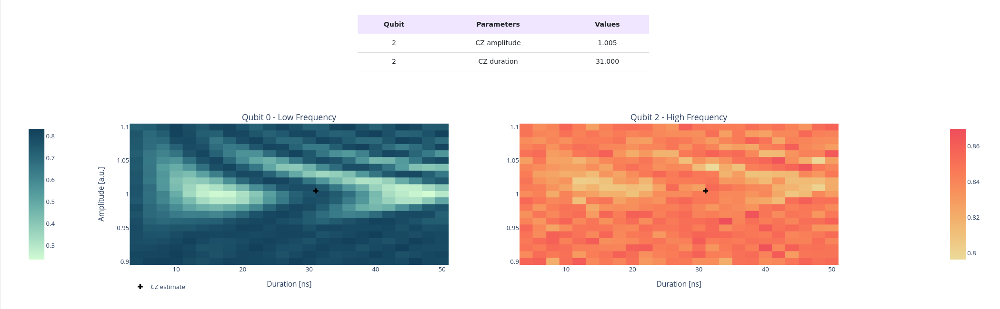

Chevron
=======

Parameters
^^^^^^^^^^

.. autoclass::
	qibocal.protocols.two_qubit_interaction.chevron.chevron.ChevronParameters
	:noindex:

Example
^^^^^^^

It follows a runcard example of this experiment.

.. code-block:: yaml

    - id: chevron
      operation: chevron
      parameters:
        amplitude_max: 1.1
        amplitude_min: 0.9
        amplitude_step: 0.01
        duration_max: 51
        duration_min: 4
        duration_step: 2

The expected output is the following:

