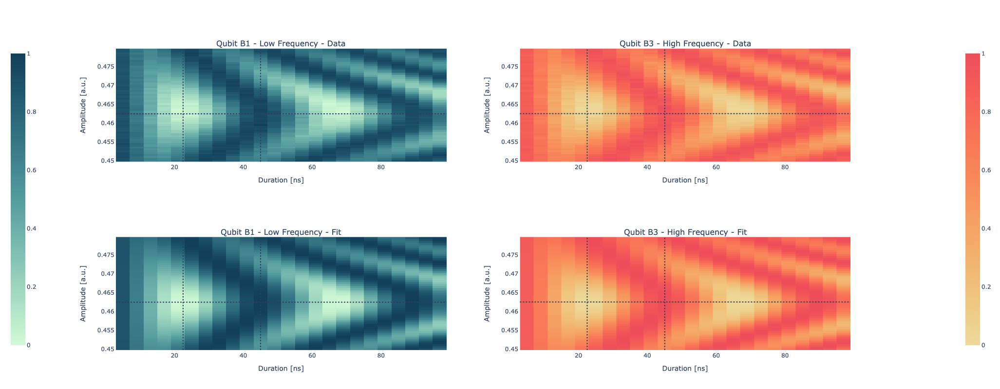

Chevron
=======

In order to implement a two-qubit gate in superconducting quantum computing, it is necessary to bring the two qubits near resonance using specific pulse sequences.
The Chevron protocol implemented in Qibocal can be used to calibrate both CZ and iSWAP gates.

The pulse sequence used to calibrate the iSWAP gate consists of a :math:`\pi` pulse followed by a flux pulse of varying amplitude and duration, applied to the qubit with the highest frequency in the pair.
The initial :math:`\pi` pulse brings the qubit into the state :math:`\ket{1}` while the flux pulse detunes its frequency near resonance with the second qubit. The implementation of the iSWAP gate leverages the avoided crossing between the states :math:`\ket{10}` and :math:`\ket{01}`.

The expected population oscillation pattern follows:

.. math::

	p_e(t, \Delta) = \frac{\Delta^2}{\Delta^2 + 4g^2} + \frac{4g^2}{\Delta^2 + 4g^2}\cos^2\left(\frac{\sqrt{\Delta^2 + 4g^2}}{2}t + \phi \right)

where :math:`\Delta=\omega_1 - \omega_2`, :math:`g` is the coupling constant for the two qubits and :math:`\phi` takes into account flux distortions.

The pulse sequence used to calibrate the CZ gate is the same as the one for the iSWAP gate, with the addition of an initial :math:`\pi` pulse applied to the qubit with the lower frequency so that both qubits are initially prepared in the :math:`\ket{1}`. With this sequence the CZ gate is implemented leveraging the avoided crossing between the states :math:`\ket{11}` and :math:`\ket{20}`.

Parameters
^^^^^^^^^^

.. autoclass::
    qibocal.protocols.two_qubit_interaction.chevron.chevron.ChevronParameters
    :noindex:

Example
^^^^^^^

Below is an example runcard for this experiment.

.. code-block:: yaml

    - id: chevron
      operation: chevron
      parameters:
        amplitude_max: 0.48
        amplitude_min: 0.45
        amplitude_step: 0.0005
        duration_max: 100
        duration_min: 5
        duration_step: 4
        relaxation_time: 50000

The expected output is the following:

.. image:: chevron.png

The plot represents the probability of measuring qubit 1 in the excited state as a function of the flux pulse parameters.
The characteristic shape of the plot, known as a Chevron pattern, appears as a consequence of the interaction of the two qubits through their coupling, leading to population exchange.

Before running the Chevron routine it may be useful to run a Cryoscope experiment in order to correct possible distortions in the flux pulse.

Chevron with signal
===================

If the readout fidelity is not high enough, it is possible to run the experiment by measuring the acquired signal.
The data are later normalized between 0 and 1. Here is a possible runcard with the corresponding outcome.

.. code-block:: yaml

    - id: chevron_signal
      operation: chevron_signal
      parameters:
        amplitude_max: 0.48
        amplitude_min: 0.45
        amplitude_step: 0.0005
        duration_max: 100
        duration_min: 5
        duration_step: 4
        relaxation_time: 50000

