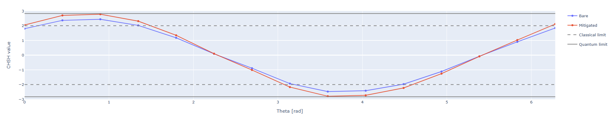

CHSH
====

The CHSH experiment is used to demonstrate the existence of entanglement via the violation
of the Clauser-Horne-Shimony-Holt (CHSH) inequality.

Parameters
^^^^^^^^^^

.. autoclass::
	qibocal.protocols.two_qubit_interaction.chsh.protocol.CHSHParameters
	:noindex:

Example
^^^^^^^
It follows a runcard example of this experiment.

.. code-block:: yaml

    - id: chsh
      operation: chsh
      targets: [[0, 1]]
      parameters:
          bell_states: [0, 1, 2, 3]
          ntheta: 20
          native: True

The expected output is the following:

.. note::
      The mitigated line will appear if the readout mitigation matrix is available in the platform calibration.
      This can be obtained using the :ref:`readout-mitigation-matrix` routine.
