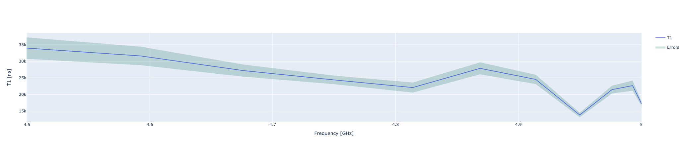
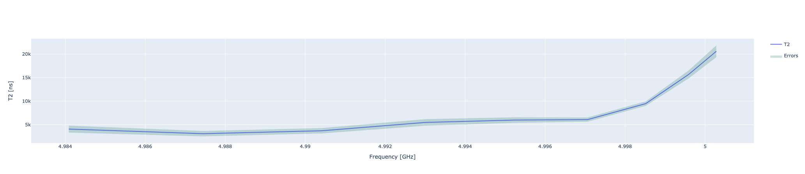

Probing coherent and relaxation times at different frequencies
==============================================================

Often superconducting qubits are operated at their "sweetspot", i.e. the point where the external noise
is reduced. In the case of flux-tunable qubits this points corresponding to the maximum frequency achievable
by the qubit as discussed in :ref:`flux`.

Even if the sweetspot should be the ideal point in order to achieve high relaxation time :math:`T_1`
and coherence time :math:`T_2`, it is not always the case due to the presence of individual
Two Level System (TLS) :cite:p:`Klimov_2018`.

For this reason it is interesting to evaluate both the relaxation time and the coherence time
while operating the qubit at different frequencies. A possible way to measure them :cite:p:`Klimov_2018` is to change the
static bias of the qubit and recalibrate the qubit in the new operative point as shown in :cite:p:`pasquale2024qibocalopensourceframeworkcalibration`.
To avoid recalibrating the qubit at each frequency, a clever approach consists in dynamically changing
the frequency of the qubit using fast flux pulses. In fact, in both the  :math:`T_1` and the  :math:`T_2`
if we play a flux pulse during the idling time of the qubit we can effectively probe both the relaxation
and the coherence time of the qubit at different frequencies without the need of recalibrating the qubit.

T1 outside the sweetspot
------------------------

In this experiment we sweep different values of qubit frequency by applying a flux pulse with variable amplitude.
For each of these values we individually measure the relaxation time :math:`T_1` of the qubit.

Parameters
^^^^^^^^^^

.. autoclass:: qibocal.protocols.coherence.t1_flux.T1FluxParameters
  :noindex:

Example
^^^^^^^

.. code-block:: yaml

    - id: t1 study
      operation: t1_flux
      parameters:
        delay_before_readout_end: 10000
        delay_before_readout_start: 4
        delay_before_readout_step: 100
        amplitude_min: 0
        amplitude_max: 0.1
        amplitude_step: 0.02
        nshots: 1000

A possible outcome measured on a qubit is the following

Requirements
^^^^^^^^^^^^

- :ref:`flux_amplitude`

T2 outside the sweetspot
------------------------

In this experiment we sweep different values of qubit frequency by applying a flux pulse with variable amplitude.
For each of these values we individually measure the relaxation time :math:`T_2` of the qubit.

Parameters
^^^^^^^^^^

.. autoclass:: qibocal.protocols.coherence.t2_flux.T1FluxParameters
  :noindex:

Example
^^^^^^^

.. code-block:: yaml

    - id: t2 study
      operation: t2_flux
      parameters:
        delay_between_pulses_end: 10000
        delay_between_pulses_step: 4
        delay_between_pulses_start: 100
        amplitude_min: 0
        amplitude_max: 0.1
        amplitude_step: 0.02
        nshots: 1000

A possible outcome measured on a qubit is the following

Requirements
^^^^^^^^^^^^

- :ref:`flux_amplitude`
