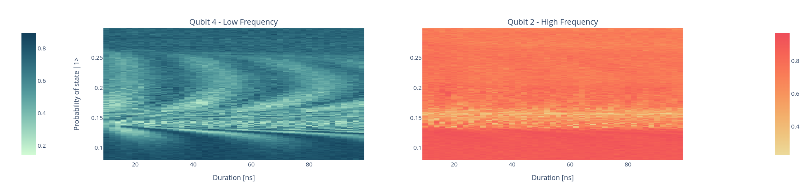

Coupler Chevron
===============

Parameters
^^^^^^^^^^

.. autoclass::
   qibocal.protocols.two_qubit_interaction.chevron.chevron.ChevronParameters
   :noindex:

Example
^^^^^^^

Below is an example runcard for this experiment.

.. code-block:: yaml

    - id: coupler chevron
      operation: coupler_chevron
      parameters:
        amplitude_max_factor: 1.5
        amplitude_min_factor: 0.4
        amplitude_step_factor: 0.005
        duration_max: 100
        duration_min: 10
        duration_step: 2
        native: CZ
        nshots: 256
        relaxation_time: 100000

The expected output is the following:

