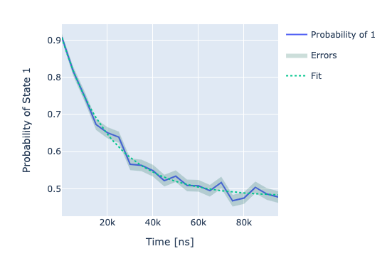

CPMG sequence
=============

In this section we show how to run the dynamical decoupling sequence CPMG.

The CPMG sequence consists in applying N equally spaced :math:`\pi` pulses
within two :math:`\pi / 2` pulses. By increasing the number of :math:`\pi` pulses :math:`T_2`
should increase since the estimation is less sensitive to noises of the type :math:`1/f`
eventually reaching the :math:`2 T_1` limit.

The fit is again a dumped exponential of the following form:

.. math::

    p_e(t) = A + B  e^{ - t / T^{(N)}_2}

Parameters
^^^^^^^^^^

.. autoclass:: qibocal.protocols.coherence.cpmg.CpmgParameters
  :noindex:

Example
^^^^^^^

A possible runcard to launch a CPMG experiment could be the following:

.. code-block:: yaml

    - id: CPMG
      operation: cpmg
      parameters:
        delay_between_pulses_end: 100000
        delay_between_pulses_start: 4
        delay_between_pulses_step: 1000
        n: 10
        nshots: 1000

The expected output is the following:

:math:`T_2` is determined by fitting the output signal using
the formula presented above.

Requirements
^^^^^^^^^^^^

- :ref:`single-shot`
