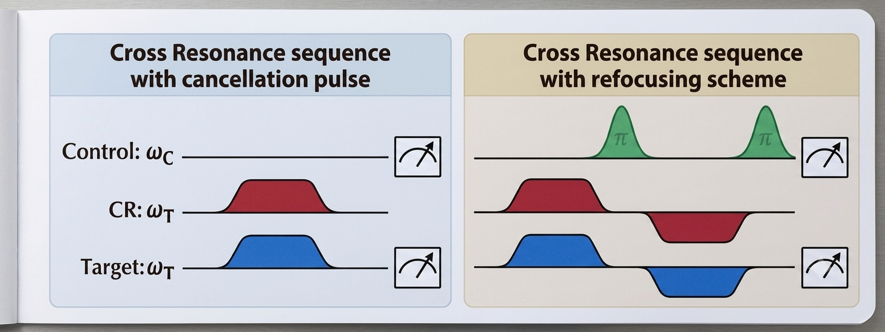
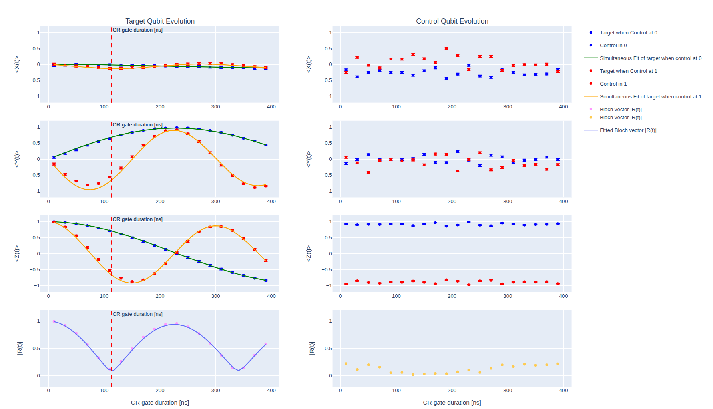
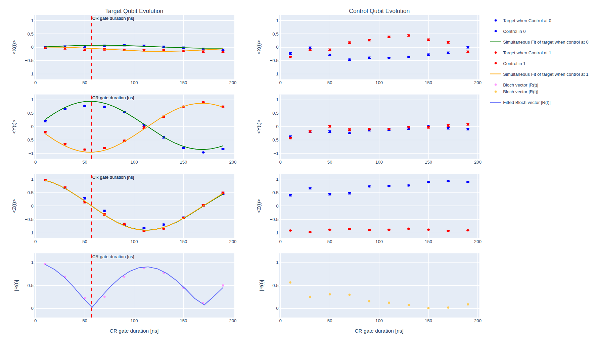
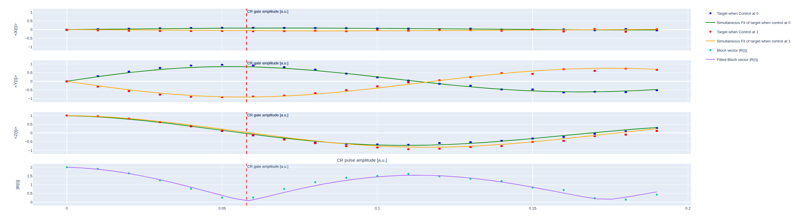
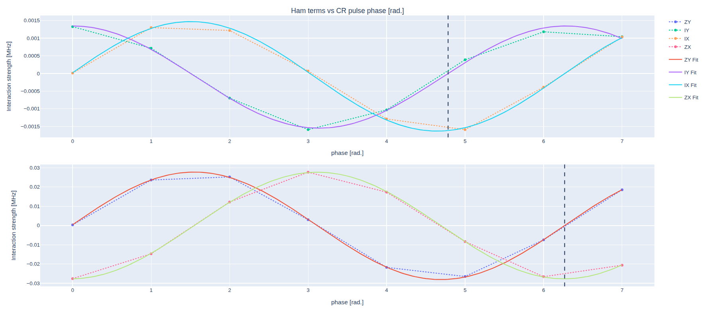
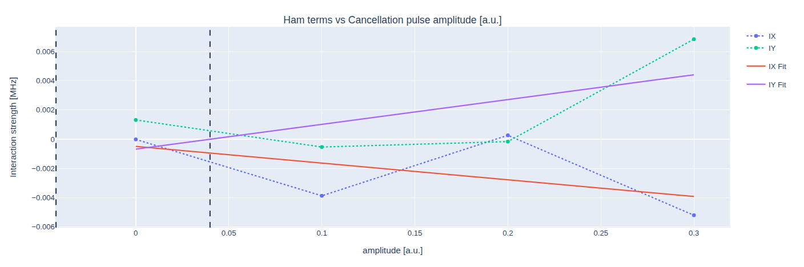

Calibration of CNOT gate using Cross-Resonance
===============================================

It is possible to generate an interaction between two superconducting qubits without requiring
flux tunability, through a mechanism known as Cross Resonance (CR). This mechanism relies only
on microwave drive pulses. Moreover, not using flux lines, results in a reduction of the number
of fridge lines and allows to decouple from the additional complexity introduced by flux noise.

The CR effect was first proposed :cite:p:`CR_First` in and later
independently discovered in :cite:p:`CR_Righetti, CR_Second`.

The CR effect can be showed by starting with the Hamiltonian of a two-qubit system with
a drive term on the first qubit :cite:p:`Manenti:2023zzn`:

.. math::

    H = b_1^\dagger b_1 \omega_1 + \frac{\alpha_1}{2} b_1^\dagger b_1^\dagger b_1 b_1 +
        b_2^\dagger b_2 \omega_2 + \frac{\alpha_2}{2} b_2^\dagger b_2^\dagger b_2 b_2 +
        g (b_1 b_2^\dagger + b_1^\dagger b_2) + \Omega(t) (b_1 + b_1^\dagger)

If the system is in the dispersive regime (i.e. :math:`|\omega_1 - \omega_2| \gg g`), through a
Schrieffer-Wolff transformation we can obtain the effective Hamiltonian:

.. math::

    H_\text{eff} = - \frac{\tilde{\omega_1}}{2} \sigma_1^z - \frac{\tilde{\omega_2}}{2} \sigma_2^z
    + \frac{\zeta}{4} \sigma_1^z \sigma_2^z
    + \Omega(t) \Big[ \sigma_1^x + \nu \sigma_2^x + \mu \sigma_1^z \sigma_2^x\Big]

If we analyze each single component of the equation above we see:

* two free-qubit terms (:math:`\propto \sigma^z_q`) proportional to the effective qubit frequencies :math:`\tilde{\omega}_q`
* ZZ interaction (:math:`\propto \sigma^z_1\sigma^z_2`) with coupling :math:`\eta` which corresponds to a conditional qubit's frequency shift.
* drive terms for both qubits (:math:`\propto \sigma^x_q`) with :math:`\nu` corresponding to the quantum crosstalk factor; quantum crosstalk parametrizes the effective coupling between the qubit and the non-directly coupled line.
* ZX interaction (:math:`\sigma_1^z\sigma^x_2`) with coupling :math:`\mu` (cross-resonance factor). In particular This term represents a conditional extra rotation along x-axis for qubit-2 depending on the state of qubit-1.

The whole idea of the Cross Resonance gate is then to exploit ZX-term by driving qubit-1 at qubit-2 frequency;
in this scheme it is easy to see that qubit-1 behaves as the control qubit while qubit-2 is the target.

It is easy to prove that the CNOT gate can be built using two single-qubits gates plus the CR gate:

.. math::

    \text{CNOT} = \text{R}_\text{ZX}(-\pi/2) \text{R}_\text{IX}(\pi/2) \text{R}_\text{ZI}(\pi/2)

Hence it is necessary to tune the amplitude and the duration of the CR drive pulse to calibrate a
:math:`\text{R}_\text{ZX}(-\pi/2)` rotation.

In Qibocal we provide protocols to calibrate CR pulses based on :cite:p:`CR_IBM`.
The calibration procedure is based on characterizing all terms of the full effective Hamiltonian via a tomography-style experiment:

.. math::

  2H_{\text{eff}}/\hbar = \Omega_{ZX}\text{ZX} + \Omega_{ZY}\text{ZY} + \Omega_{IX}\text{IX} + \Omega_{IY}\text{IY} + \Omega_{XI}\text{XI} + \Omega_{YI}\text{YI} + \varepsilon\text{ZZ}

By measuring the target-qubit response for different states of the control qubit, the strengths of both the desired
interaction and the accompanying unwanted terms are extracted; these parasitic terms arise from drive crosstalk and
off-resonant interactions and can significantly affect gate performance.
The overall strategy is therefore to characterize the error channels at the Hamiltonian level and compensate them through calibrated control pulses.

In particular, an oscillating drive on the target qubit suppresses unwanted single-qubit rotations (IX, IY),
while echo sequences mitigate over essentially ZZ contribution.
By measuring the effective Hamiltonian after each calibration step and iteratively tuning the amplitudes, phases,
and timings of the added pulses, the undesired interactions are progressively removed,
leaving the desired conditional ZX coupling as the dominant term.
Also, we can assume that the XI and YI terms (CR pulse driving the control qubit) are essentially small and can be neglected
since in general the two qubits are far in frequency then the CR pulse is far off-resonance with the control.

Here there is a schematic representation of the two pulse sequences, with and without echo:

The CR tune-up procedure consists of three main steps. While a cross-resonance pulse alone is sufficient to generate the conditional interaction
required for an entangling gate, the complete tune-up procedure is designed to optimize its performance by suppressing unwanted interaction terms
and mitigating error sources. The three steps can be summarized as follow:

* **Hamiltonian tomography and gate-length calibration**: a quantum tomography-like experiment is performed to identify the CR pulse duration that maximizes the separation between the two conditional rotations on the Bloch sphere.
* **Phase calibration of CR and cancellation pulses**: the previous experiment is repeated while changing the CR pulse phase, then the phase which minimizes misaligned ZY-term is selected.
* **Amplitude calibration of the cancellation pulse**: similarly to the phase calibration, the experiment is repeated while sweeping the cancellation pulse amplitude. The optimal amplitude is then selected as the one that minimizes the unwanted IX and IY crosstalk terms in the effective Hamiltonian.

Hamiltonian tomography and gate-length calibration
-------------------------------------

In the initial experiment, we sweep the duration of the CR pulse and measure the state of both the control and target qubits.
This measurement is performed twice: first with the control qubit prepared in the :math:`|0\rangle` state, and then in the :math:`|1\rangle` state.

Parameters
^^^^^^^^^^

.. autoclass:: qibocal.protocols.two_qubit_interaction.cross_resonance.cross_resonance_length.HamiltonianTomographyCRLengthParameters
  :noindex:

Example
^^^^^^^

A possible runcard to launch the experiment could be the following:

.. code-block:: yaml

  - id: CR length
    operation: cr_length
    targets: [[0, 1]]
    parameters:
      duration_range: [10, 400, 10]
      pulse_amplitude: 0.1
      echo: false
      nshots: 2000
      relaxation_time: 50000

The expected output is the following:

We can also see the effect of interleaving refocusing pulses in the middle of the pulse sequence:

.. code-block:: yaml

  - id: CR length
    operation: cr_length
    targets: [[0, 1]]
    parameters:
      duration_range:
      - 10
      - 200
      - 10
      pulse_amplitude: 0.1
      echo: true
      nshots: 2000
      relaxation_time: 50000

When the echo sequence is enabled, the duration of each individual pulse is shortened. This occurs because the sequence now
includes two out of phase CR pulses of equal length, bringing the total sequence duration to :math:`2\tau_{\text{CR}} + 2\tau_{\pi}`.

Post-processing
^^^^^^^^^^^^^^^

The target qubit's state probability is fitted simultaneously across all three axes for both control state preparations,
as the trajectories are physically constrained by the unitarity of the state norm.
Although theoretically exact, enforcing this constraint can make the fit highly sensitive to experimental errors and
data fluctuations.

Once the two trajectories (for control prepared in :math:`\{0,1\}`) are fitted to obtain the oscillation frequencies
:math:`\vec{\Omega}^{\{0, 1\}}`, the Hamiltonian coefficients can be extracted using the following system of equations:

* :math:`\Omega_{ZX} = \frac{\Omega^0_X - \Omega^1_X}{2}`
* :math:`\Omega_{IX} = \frac{\Omega^0_X + \Omega^1_X}{2}`
* :math:`\Omega_{ZY} = \frac{\Omega^0_Y - \Omega^1_Y}{2}`
* :math:`\Omega_{IY} = \frac{\Omega^0_Y + \Omega^1_Y}{2}`
* :math:`\Omega_{ZZ} = \frac{\Omega^0_Z - \Omega^1_Z}{2}`
* :math:`\Omega_{IZ} = \frac{\Omega^0_Z + \Omega^1_Z}{2}`

Finally the CR gate optimal duration is estimated by minimizing the Bloch vector norm :math:`|\vec{R}|` defined as:

.. math::

  |\vec{R}| = \frac{1}{2}\sqrt{(\langle X \rangle_0 + \langle X \rangle_1)^2 + (\langle Y \rangle_0 + \langle Y \rangle_1)^2 + (\langle Z \rangle_0 + \langle Z \rangle_1)^2}

This quantity represents the geometric overlap between the two trajectories on the Bloch sphere;
minimizing it maximizes the distance between them.

Sweeping amplitude of the CR pulse
----------------------------------

Similarly it is possible to sweep the amplitude of the CR pulse and measure both the
target and control qubit.

Parameters
^^^^^^^^^^

.. autoclass:: qibocal.protocols.two_qubit_interaction.cross_resonance.cross_resonance_amplitude.HamiltonianTomographyCRAmplParameters
  :noindex:

Example
^^^^^^^

A possible runcard to launch the experiment could be the following:

.. code-block:: yaml

  - id: CR amplitude
    operation: cr_amplitude
    parameters:
      amplitude_range:
      - 0.01
      - 0.1
      - 0.005
      echo: true
      nshots: 1000
      pulse_duration: 200
      relaxation_time: 50000

The expected output is the following:

Post-processing
^^^^^^^^^^^^^^^

The post-processing is the same as for the CR-duration experiment.

Phase calibration of CR and cancellation pulses
----------------------------------

This step aligns both the CR and cancellation pulses along the correct axis (the x-axis).
The standard CR-duration experiment is repeated while sweeping the CR pulse phase. At each phase point, all Hamiltonian
terms are extracted as described above.

Using these measurements, the algorithm fits the IX, IY, ZX, and ZY terms with sinusoidal functions to determine the two
phases, :math:`\phi_0` and :math:`\phi_1`, that nullify the ZY and IY terms, respectively.
Because a full-period scan yields two possible phase values per term, the algorithm selects the value that maximise the
orthogonal component.

Once both phases are uniquely identified, the CR pulse phase is set to :math:`\phi_{CR}=\phi_0`, while the cancellation
pulse phase is configured as :math:`\phi_{Canc}=\phi_0 - \phi_1`.

Parameters
^^^^^^^^^^

.. autoclass:: qibocal.protocols.two_qubit_interaction.cross_resonance.cancellation_phase.HamiltonianTomographyCANCPhaseParameters
  :noindex:

Example
^^^^^^^

A possible runcard to launch the experiment could be the following:

.. code-block:: yaml

  - id: cancellation_phase_tuning
    operation: cancellation_phase_tuning
    parameters:
      duration_range:
      - 10
      - 210
      - 20
    echo: true
    phase_range:
      - 0.0
      - 7.1
      - 1.0
    nshots: 1000
    relaxation_time: 50000

The expected output is the following:

Amplitude calibration of the cancellation pulse
----------------------------------

This final step is necessary to cancel out the remaining single-qubit drive terms affecting the target qubit
(IX and IY).
Having determined the phases for both the CR and cancellation pulses, this protocol sweeps the cancellation
pulse amplitude over varying CR durations. At each step, the protocol extracts the coefficients of all
Hamiltonian terms.

Unlike the phase tuning protocol, this experiment applies a linear fit exclusively to the measured
IX and IY terms to determine the two zero-interaction amplitudes.

As described in :cite:p:`CR_IBM`, the two nulling amplitudes for IX and IY should coincide, , since the cancellation pulse
phase is aligned with the expected rotation axis.
If they diverge, iterating the experiment with adjusted :math:`\phi_{CR}` and :math:`\phi_{Canc}` phases may be required.

By default, however, the protocol simply selects the amplitude :math:`a_{Canc}` that nulls the IY term;
while this does not entirely eliminate all parasitic rotations, it successfully cancels out the rotations
orthogonal to the primary ZX interaction.

Parameters
^^^^^^^^^^

.. autoclass:: qibocal.protocols.two_qubit_interaction.cross_resonance.cancellation_amplitude.HamiltonianTomographyCANCAmplParameters
  :noindex:

Example
^^^^^^^

A possible runcard to launch the experiment could be the following:

.. code-block:: yaml

  - id: cancellation_amplitude_tuning
    operation: cancellation_amplitude_tuning
    parameters:
      duration_range:
      - 10
      - 210
      - 20
      echo: true
      target_ampl_range:
      - 0.0
      - 0.4
      - 0.1
    nshots: 1000
    relaxation_time: 50000

The expected output is the following:

.. note::
The ``cancellation_phase_tuning`` and ``cancellation_amplitude_tuning`` protocols support an additional
input parameter, ``verbose_plot``. It defaults to ``False``; enabling it (``True``) generates plots of
the measured signal for each axis at every sweeper point.

Requirements
^^^^^^^^^^^^

To run these experiments single qubit gates for both target and control qubit needs to be calibrated.
