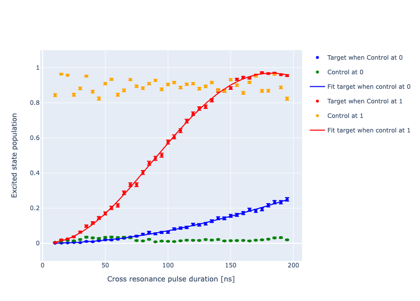

Calibration of CNOT gate using Cross-Resonance
===============================================

It is possible to generate an interaction between two superconducting qubits without requiring
flux tunability, through a mechanism known as Cross Resonance (CR). This mechanism relies only
on microwave drive pulses. Moreover, not using flux lines, results in a reduction of the number
of fridge lines and allows to ignore all problems related to flux noise.

The cross resonance effect was first proposed :cite:p:`CR_First` in and later
independently discovered in :cite:p:`CR_Righetti, CR_Second`.

The CR effect can be showed by starting with the Hamiltonian of a two-qubit system with
a drive term on the first qubit :cite:p:`Manenti:2023zzn`

.. math::

    H = b_1^\dagger b_1 \omega_1 + \frac{\alpha_1}{2} b_1^\dagger b_1^\dagger b_1 b_1 +
        b_2^\dagger b_2 \omega_2 + \frac{\alpha_2}{2} b_2^\dagger b_2^\dagger b_2 b_2 +
        g (b_1 b_2^\dagger + b_1^\dagger b_2) + \Omega(t) (b_1 + b_1^\dagger)

If we are in a dispersive regime (i.e. :math:`|\omega_1 - \omega_2| \gg g`), through a
Schrieffer-Wolff transformation we can obtain the effective Hamiltonian:

.. math::

    H_\text{eff} = - \frac{\tilde{\omega_1}}{2} \sigma_1^z - \frac{\tilde{\omega_2}}{2} \sigma_2^z
    + \frac{\zeta}{4} \sigma_1^z \sigma_2^z
    + \Omega(t) \Big[ \sigma_1^x + \nu \sigma_2^x + \mu \sigma_1^z \sigma_2^x\Big]

where :math:`\zeta` is the ZZ coupling, :math:`\nu` is quantum crosstalk factor and :math:`\mu` is the
cross-resonance factor. From the equation above we can see that by driving the first qubit
at the frequency of the second qubit .

By tuning the amplitude and the duration of this drive pulse it is possible to calibrate a
:math:`RZX` rotation to rotate exactly by :math:`- \pi/2`. This is done because starting
from a :math:`ZX_{frac{\pi}{2}}` we can obtain a CNOT gate using single qubit rotations.

.. math::

    \text{CNOT} = \text{R}_\text{ZX}(-\pi/2) \text{R}_\text{IX}(\pi/2) \text{R}_\text{ZI}(\pi/2)

In Qibocal we provide protocols to calibrate CR pulses.

Sweeping the duration of the CR pulse
-------------------------------------

In a first experiment we can sweep the duration of the CR pulse and measure both the
target and control qubit. The measurement is performed while preparing the control
qubit in state :math:`\ket{0}` and :math:`\ket{1}`.

Parameters
^^^^^^^^^^

.. autoclass:: qibocal.protocols.two_qubit_interaction.cross_resonance.length.CrossResonanceLengthParameters
  :noindex:

Example
^^^^^^^

A possible runcard to launch the experiment could be the following:

.. code-block:: yaml

  - id: CR length
    operation: cross_resonance_length
    parameters:
      targets: [[0,1]]
      pulse_duration_start: 10
      pulse_duration_end: 200
      pulse_duration_step: 10
      flux_pulse_amplitude: 0.1
      nshots: 2000
      relaxation_time: 50000

The expected output is the following:

Post-processing
^^^^^^^^^^^^^^^

The probability of the target qubit is fitted in both cases to a dumped cosine functions.
It is possible to extract the effective coupling as

.. math::

    \text{J}_\text{eff}/ 2 \pi = \frac{f^{\pi}_\text{Rabi} - f_\text{Rabi}}{2}

where :math:`f^{\pi}_\text{Rabi}` and :math:`f_\text{Rabi}` are the frequencies of the
fitted Rabi oscillations on the target qubit.

Sweeping amplitude of the CR pulse
----------------------------------

Similarly it is possible to sweep the amplitude of the CR pulse and measure both the
target and control qubit.

Parameters
^^^^^^^^^^

.. autoclass:: qibocal.protocols.two_qubit_interaction.cross_resonance.length.CrossResonanceLengthParameters
  :noindex:

Example
^^^^^^^

A possible runcard to launch the experiment could be the following:

.. code-block:: yaml

  - id: CR amplitude
    operation: cross_resonance_amplitude
    parameters:
      targets: [[0,1]]
      max_amp: 0.05
      min_amp: 0.01
      step_amp: 0.005
      pulse_duration: 100
      nshots: 2000
      relaxation_time: 50000

The expected output is the following:

Post-processing
^^^^^^^^^^^^^^^

The probability of the target qubit is fitted in both cases to a cosine function.

Hamiltonian Tomography measurement
----------------------------------

Although from the two previous experiments it is possible to perform an initial
calibration of the CR gate, by performing a state tomography on the target qubit it is
possible to reconstruct the effective Hamiltonian of the system :cite:p:`CRDrag`:

.. math::

    H_\text{eff} = \frac{\nu_\text{ZX}}{2} \text{ZX} + \frac{\nu_\text{ZY}}{2} \text{ZY} +
                    \frac{\nu_\text{ZZ}}{2} \text{ZZ} + \frac{\nu_\text{IX}}{2} \text{IX} +
                    \frac{\nu_\text{IY}}{2} \text{IY} + \frac{\nu_\text{IZ}}{2} \text{IZ}

In particular, by sweeping the duration of the CR pulse and measuring the expectation
values of the target qubit :math:`\langle X \rangle`, :math:`\langle Y \rangle` and :math:`\langle Z \rangle`
when the control qubit is prepared in :math:`\ket{0}` and :math:`\ket{1}` we can compute all terms in
the effective Hamiltonian following the procedure in :cite:p:`CRDrag`.

Parameters
^^^^^^^^^^

.. autoclass:: qibocal.protocols.two_qubit_interaction.cross_resonance.hamiltonian_tomography.length.HamiltonianTomographyCRLengthParameters
  :noindex:

Example
^^^^^^^

A possible runcard to launch the experiment could be the following:

.. code-block:: yaml

  - id: Hamiltonian tomography CR
    operation: cross_resonance_amplitude
    parameters:
      targets: [[0,1]]
      nshots: 2000
      pulse_amplitude: 0.1
      pulse_duration_end: 400
      pulse_duration_start: 10
      pulse_duration_step: 20

The expected output is the following:

Requirements
^^^^^^^^^^^^

To run these experiments single qubit gates for both target and control qubit needs
to be calibrated.
