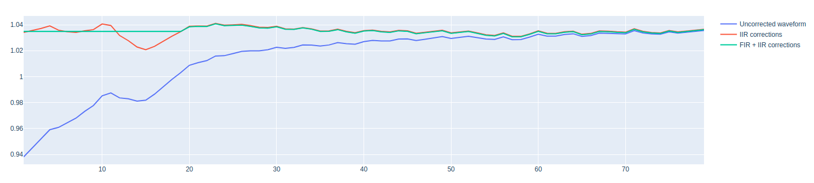

Cryoscope experiment
====================

In this section we show how to run a cryoscope experiment using Qibocal.

The goal of the Cryoscope experiment is to reconstruct the shape of the flux pulse sent to the qubit in order to determine correction for signal distortions.
To do this we exploit the dependence of the transition frequency of a transmon qubit on the magnetic flux

.. math:: f_Q(\Phi_Q)\approx \frac{1}{h} \left( \sqrt{8E_J E_C \left| \cos\left(\pi\frac{\Phi_Q}{\Phi_0}\right) \right|} - E_C \right)
    :label: transmon

where :math:`E_C` is the charging energy,  :math:`E_J` is the sum of the Jospehson energies and :math:`\Phi_0` is the flux quantum.
The routine implementation follows the description given in :cite:p:`Cryoscope_20`:

.. _cryoscope:

Cryoscope
---------
The cryoscope experiment consists of a Ramsey-like experiment where a flux pulse is embedded between the two :math:`\pi/2` pulses separated by a fixed time interval :math:`T`.
The first :math:`\pi /2` rotation around the :math:`Y` axis change the qubit state from :math:`\ket{0}` to :math:`\frac{\ket{0}+\ket{1}}{\sqrt{2}}`; then the flux pulse transforms the qubit state to :math:`\frac{\ket{0}+e^{i\phi_\tau}\ket{1}}{\sqrt{2}}` where

.. _phase:

.. math:: \frac{\phi_\tau}{2\pi} = \int_0^T \Delta f_Q(\Phi_{Q,\tau}(t))dt
    :label: phase

Then the experiment is completed with a :math:`\pi/2` rotation either around the :math:`y` axis or around the :math:`x` axis in order to obtain, respectively the :math:`\langle Y \rangle` or  :math:`\langle X \rangle` component of the Bloch vector.
From the :math:`\langle X \rangle` and :math:`\langle Y \rangle` components of the Bloch vector we can derive the relative phase :math:`\phi_\tau` which in turn can be used to computed

.. math::

    \Delta f_R \equiv \frac{\phi{\tau+\Delta\tau} - \phi_{\tau}}{2\pi \Delta\tau}

and then we can extract an estimate of the effective flux pulse :math:`\Phi_Q(t)` on the qubit by inverting :math:numref:`transmon`.

Parameters
^^^^^^^^^^

.. autoclass:: qibocal.protocols.flux_dependence.cryoscope.CryoscopeParameters
  :noindex:

Example
^^^^^^^

A possible runcard to launch a Cryoscope experiment could be the following:

.. code-block:: yaml

  - id: cryoscope

    operation: cryoscope
    parameters:
      duration_max: 80
      flux_pulse_amplitude: 0.7
      fir: 32
      iir: true
      relaxation_time: 50000

The expected output is the following:

.. note::
  The flux pulse duration is swept one sample at a time, from a single sample up to
  ``duration_max``. Set ``iir: false`` to determine only an FIR filter. On instruments
  that enforce a minimum pulse duration (e.g. Qblox), use ``padding_duration`` to
  prepend leading zeros to the flux pulse, so that also flux pulses below that limit can
  be executed.

  If no filters are configured, the protocol computes the FIR and IIR filters and
  updates the platform. If filters are already present, they are left untouched and only
  the reconstructed waveform is shown. This makes it possible to run the protocol a
  second time to validate the previously determined filters.

Requirements
^^^^^^^^^^^^

- :ref:`single-shot`
- :ref:`flux_amplitude`
