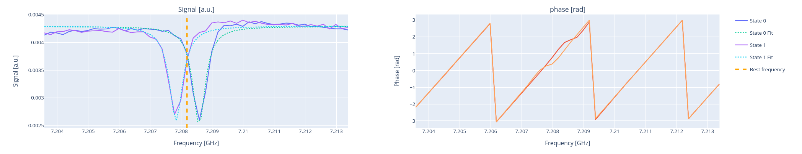

.. _dispersive_shift:

Dispersive shift
================

In this section we present the dispersive shift routines provided by Qibocal.

Theory
------

A system with a qubit and a resonator, interacting with each other, is described by the James-Cummings Hamiltonian.
Restricting the qubit states to the first two levels, we get

.. math::
	\hat{H}_{\text{JC}} = \hbar \omega_r \hat{a}^\dagger \hat{a} + \frac{\hbar \omega_q}{2} \hat{\sigma}_z + \hbar g (\hat{a}^\dagger \hat{\sigma}_- + \hat{a} \hat{\sigma}_+)

where :math:`\omega_r` and :math:`\omega_q` are respectively the resonator and the qubit frequencies, and :math:`g` is the coupling
constant between the qubit and the resonator.
In the dispersive regime :math:`g \ll \lvert \omega_r - \omega_q \rvert`, the Hamiltonian can be rewritten as

.. math::
	:label: eq_1

	\hat{H}_{\text{eff}} = \hbar \hat{a}^\dagger \hat{a} (\omega_r - \chi \hat{\sigma}_z) + \frac{\hbar}{2} (\omega_q + \chi) \hat{\sigma}_z

where we introduced the dispersive shift

.. math::
	\chi = \frac{g^2}{\lambda}.

Equation :eq:`eq_1` shows that the resonator frequency is :math:`\omega_{r,0} = \omega_r - \chi` (:math:`\omega_{r,1} = \omega_r + \chi`) when the
qubit is in the ground (excited) state. The separation between the two freqiencies is :math:`\lvert 2 \chi \rvert`.

Routine description
^^^^^^^^^^^^^^^^^^^
After collecting the data from the two spectroscopies, for each readout frequency the distance of the centers of the blobs for
:math:`\ket{0}` and :math:`\ket{1}` states are evaluated. The best readout frequency is the one maximizing the distance between the two blobs.

Parameters
^^^^^^^^^^

.. autoclass:: qibocal.protocols.dispersive_shift.DispersiveShiftParameters
	:noindex:

Example
^^^^^^^
It follows an example of the experiment parameters.

.. code-block:: yaml

    - id: dispersive shift qt
      operation: dispersive_shift_qutrit
      parameters:
        freq_step: 200000
        freq_width: 1000000

After running `qq auto`, the experiment is executed and the result will looks like
the following picture.

Requirements
^^^^^^^^^^^^
- :ref:`rabi`
