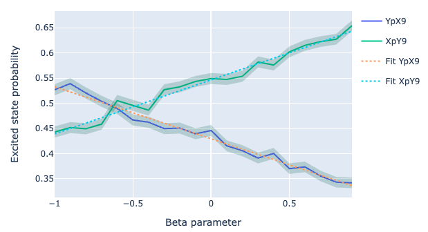

DRAG experiments
================

In this section we show how to run Ramsey experiments using Qibocal

.. _drag:

DRAG :cite:p:`Motzoi_2009, Gambetta_2011`: pulses can be used to lower both phase and leakage errors,
it consists in adding a quadrature component to the pulse which is proportional
to the time derivative of the phase component. Given a pulse with a phase component :math:`\Omega_x`
the quadrature component :math:`\Omega_y` is evaluated as

.. math::

    \Omega_y (t) = \beta \frac{d\Omega_x}{dt} ,

where :math:`\beta` is a scaling parameter.

Qibocal provides two separate protocols to extract :math:`\beta`.

Method 1
--------

:math:`\beta` can be extracted by playing the pulse sequence composed by
:math:`[R_X(\pi) - R_X(-\pi)]^N` for different values of :math:`\beta` as shown in  :cite:p:`Sheldon_2016`.
The post-processing consists in measuring the probability of :math:`\ket{0}` for every :math:`\beta`
and fitting the curve with a cosine. The correct :math:`\beta` value is the one which maximizes
the curve.

Parameters
^^^^^^^^^^

.. autoclass:: qibocal.protocols.drag.DragTuningParameters
  :noindex:

Example
^^^^^^^

.. code-block:: yaml

      - id: drag tuning
        operation: drag_tuning
        parameters:
            beta_start: -1
            beta_end: 1
            beta_step: 0.1
            nflips: 5
            unrolling: true

Running this protocol you should get something like this:

.. image:: drag_tuning.png

Method 2
--------

The second method consists in playing two different sequences
:math:`R_Y(\pi) R_X(\pi/2)` and :math:`R_X(\pi) R_Y(\pi/2)` which are two
of the AllXY pulses which exhibit opposite sign of phase error as highlighted
in :cite:p:`reed2013entanglementquantumerrorcorrection`.
The post-processing consists in measuring the probability of :math:`\ket{1}` for every :math:`\beta`
and performing a linear fit for both sequences. The correct :math:`\beta` value is the one where the two lines
cross.

Parameters
^^^^^^^^^^

.. autoclass:: qibocal.protocols.drag_simple.DragTuningSimpleParameters
  :noindex:

Example
^^^^^^^

.. code-block:: yaml

      - id: drag simple
        operation: drag_simple
        parameters:
            beta_start: -1
            beta_end: 1
            beta_step: 0.1
            unrolling: true

Requirements
^^^^^^^^^^^^

- :ref:`single-shot`
