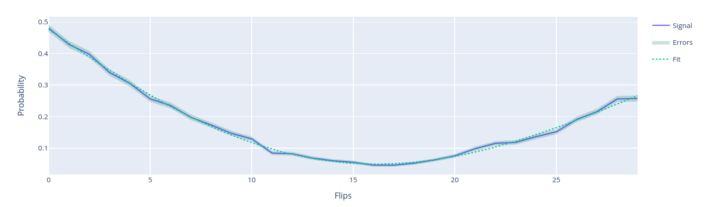

Flipping
========

The flipping experiment corrects the amplitude in the qubit drive pulse. In this experiment,
we applying an :math:`R_x(\pi/2)` rotation followed by :math:`N` flips (or :math:`R_x(\pi)` rotations)
and we measure the qubit state.
The first :math:`R_x(\pi/2)` is necessary to discriminate the over rotations and under rotations of the :math:`R_x(\pi)` pulse:
without it the difference between the two cases is just a global phase, i.e., the
probabilities are the same, with the :math:`R_x(\pi/2)` pulse, in case of under rotations the state will be closer to :math:`\ket{0}`
after performing an even number of :math:`R_x(\pi)` pulses, in the over rotations one the final state will be closer to :math:`\ket{1}`.

By fitting the resulting data with a sinusoidal function, we can determine the delta amplitude, which allows us to refine the
:math:`\pi` pulse amplitue.

Example
^^^^^^^
It follows a runcard example of this experiment.

.. code-block:: yaml

	- id: flipping
	  operation: flipping
	  parameters:
	    detuning: 0.05
	    nflips_max: 30
	    nflips_step: 1

A detailed explanation of the parameters can be found in :class:`qibocal.protocols.flipping`.

The expected output is the following:

