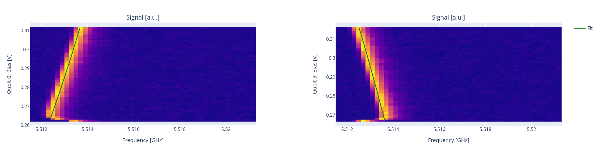

Flux crosstalk experiments
==========================

In this section we show how to run flux crosstalk experiments.

As we saw in :ref:`flux` the external flux affecting a qubit line :math:`i`
will receive contributions from other qubits

.. math::

    \Phi_i = \sum_{j} C_{ij} V_j +  \Phi_i^{\text{offset}} \quad ,

which means that the transmon frequency can change when current is applied
on other qubits.

.. _qubit_crosstalk:

Qubit crosstalk
---------------

It is possible to measure qubit crosstalk by running a `qubit_crosstalk` experiment.
Assuming that the target qubit is at the sweetspot, in order to measure crosstalk
effects it is suggested to bias the qubit away.

Here is a possible runcard where we measure the crosstalk on qubit 2
caused by qubit 3 and 0.

Parameters
^^^^^^^^^^

.. autoclass:: qibocal.protocols.flux_dependence.qubit_crosstalk.QubitCrosstalkParameters
  :noindex:

Example
^^^^^^^

.. code-block:: yaml

    - id: qubit crosstalk
      operation: qubit_crosstalk
      targets: [2]
      parameters:
        bias_point:
            2: 0.25
        bias_step: 0.001
        bias_width: 0.05
        drive_amplitude: 0.002
        drive_duration: 4000
        flux_qubits: [0, 3]
        freq_step: 200000
        freq_width: 10000000
        nshots: 1024
        relaxation_time: 20000

The previous runcard aims at extracting the crosstalk coefficients
:math:`C_{20}` and :math:`C_{23}`.

Requirements
^^^^^^^^^^^^

- :ref:`qubit_flux`
