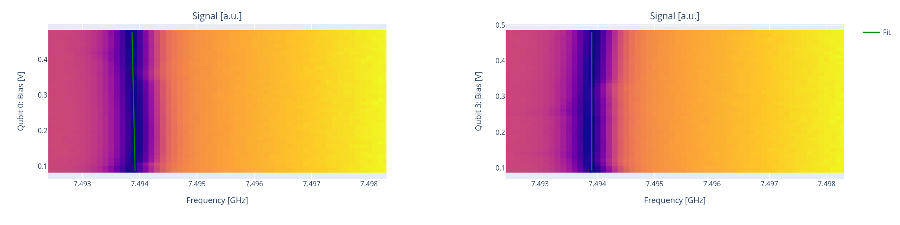

Flux crosstalk experiments
==========================

In this section we show how to run flux crosstalk experiments.

As we saw in :ref:`flux` the external flux affecting a qubit line :math:`i`
will receive contributions from other qubits

.. math::

    \Phi_i = \sum_{j} C_{ij} V_j +  \Phi_i^{\text{offset}} \quad ,

which means that transmon frequency can change when current is applied
on other qubits.

Qubit crosstalk
---------------

It is possible to measure qubit crosstalk by running a `qubit_crosstalk` experiment.
Assuming that the target qubit is at the sweetspot, in order to measure crosstalk
effects it is suggested to bias the qubit away.

Here is a possible runcard where we measure the crosstalk on qubit 2
caused by qubit 3 and 0.

A description of the parameters is available in :class:`qibocal.protocols.flux_dependence.qubit_crosstalk.QubitCrosstalkParameters`.

.. code-block:: yaml

    - id: qubit crosstalk
      operation: qubit_crosstalk
      targets: [2]
      parameters:
        bias_point:
            2: 0.25
        bias_step: 0.001
        bias_width: 0.05
        drive_amplitude: 0.002
        drive_duration: 4000
        flux_qubits: [0, 3]
        freq_step: 200000
        freq_width: 10000000
        nshots: 1024
        relaxation_time: 20000

The previous runcard aims at extracting the crosstalk coefficients
:math:`C_{20}` and :math:`C_{23}`.

Resonator crosstalk
-------------------

In a similar fashion it is possible to repeat the previous experiment
by sweeping the readout frequency. Note that in this case it will be
necessary to bias the qubit away from its sweetspot more to observe
significant variations.

.. code-block:: yaml

    - id: resonator crosstalk
      operation: resonator_crosstalk
      targets: [2]
      parameters:
        bias_point:
            2: 0.5
        bias_step: 0.01
        bias_width: 0.4
        flux_qubits: [0, 3]
        freq_step: 100000
        freq_width: 6000000
        nshots: 2000

A description of the parameters is available in :class:`qibocal.protocols.flux_dependence.resonator_crosstalk.ResCrosstalkParameters`.

As we can see, even by bias the qubit away we are not able to see
a dependence by only a shift in frequency which is expected by biasing the qubit.

The protocols aims at extracting the crosstalk coefficients
:math:`C_{20}` and :math:`C_{23}`.
