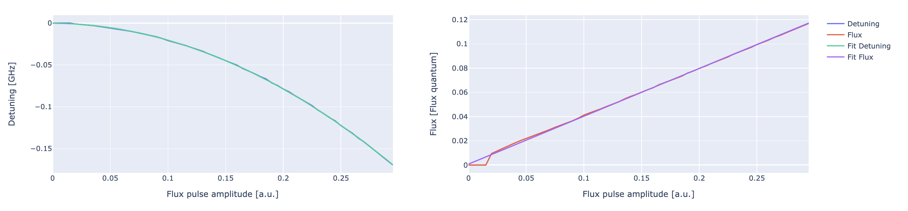
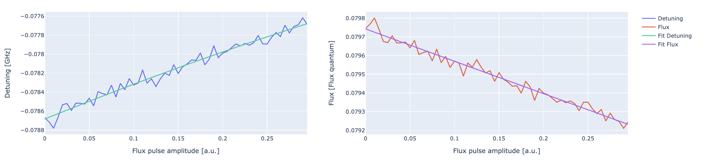

.. _flux_amplitude:

Measuring detuning of qubit frequency using fast flux-pulses
============================================================

The following experiments are similar to the :ref:`flux` but instead of modifying the
static bias and measuring the qubit frequency with a spectroscopic measurement the qubit
frequency is measured through a Ramsey-like experiment.

After bringing the qubit to a superposition state with a :math:`R_Y(\pi/2)`, we apply a flux
pulse for a fixed time :math:`\tau` and we measure :math:`\langle X \rangle` and :math:`\langle Y \rangle`
by rotating the qubit accordingly before the measurement. By repeating the sequence
for different flux pulse amplitude values we should observe a detuning described by Eq. :math:numref:`transmon`,
the detuning is defined as

.. math::

     \Delta f_q(\Phi) =  f_q(\Phi=0) -  f_q(\Phi)

where :math:`f_q(\Phi=0)` corresponds to the qubit frequency when no magnetic flux generated by fast-flux
pulses is present. In the case where the qubit is biased at the sweetspot :math:`f_q(\Phi=0) = f_q^{\text{max}}`.

Parameters
^^^^^^^^^^
.. autoclass:: qibocal.protocols.flux_amplitude_frequency.FluxAmplitudeFrequencyParameters
  :noindex:

Here is a possible runcard to run the experiment:

.. code-block:: yaml

    - id: flux_amplitude_frequency
      operation: flux_amplitude_frequency
      parameters:
          amplitude_max: 0.3
          amplitude_min: 0
          amplitude_step: 0.005
          duration: 60

After running the protocol the results should be the following

On the left we can see the detuning on the qubit frequency as a function of the flux pulse amplitude (blue)
with the corresponding fit (green). Although the correct formula is given by Eq. :math:numref:`transmon`
in this protocol we approximate the dependence using a quadratic form.

On the right we derive the how the magnetic flux changing by applying a flux pulse by inverting Eq. Eq. :math:numref:`transmon`
to compute the flux experienced by the qubit. We are using an approximation where we neglect both the anharmonicity
and asymmetry of the junction. We expect a linear dependence which is fitted accordingly.

Flux-crosstalk measurements
---------------------------

Using the same protocol we can select to sweep the amplitude of a flux pulse applied to a neighboring qubit
with the option `crosstalk_qubit`. In this case to measure effectively the crosstalk coefficient it might be necessary
to move the target qubit on a flux-sensitive point. This can be done with the parameter `flux_pulse_amplitude` which
will apply a flux pulse on the target qubit with the specified amplitude while sweeping the amplitude of the flux pulse
applied to `crosstalk_qubit`.

Here is a possible runcard.

.. code-block:: yaml

  - id: flux_amplitude_frequency
    operation: flux_amplitude_frequency
    parameters:
        amplitude_max: 0.3
        amplitude_min: 0
        amplitude_step: 0.005
        crosstalk_qubit: B1
        duration: 60
        flux_pulse_amplitude: 0.2

with the corresponding outcome.

Requirements
^^^^^^^^^^^^

- :ref:`single-shot`
