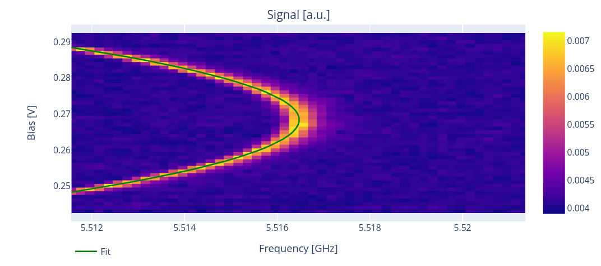
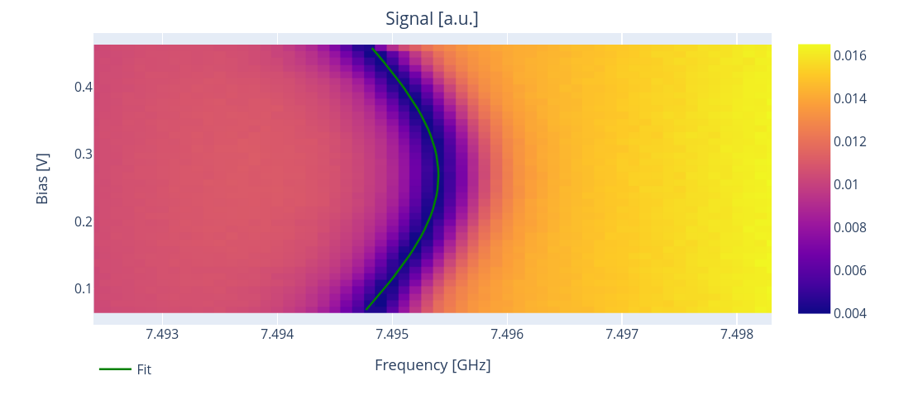

.. _flux:

Frequency vs flux experiments
=============================

In this section we show how to run experiments to study
the flux dependence.

Flux-tunable transmons
----------------------

It can be shown for flux-tunable transmons applying an external flux
:math:`\Phi` induces to a detuning on the transmon frequency :cite:p:`Koch_2007`.
Applying short flux pulses it is possible to tune the transmon frequency in order
of GHz, which leads to several applications including quantum logical gates.

The transmon frequency as a function of the external flux can be expressed as :cite:p:`Barrett_2023`

.. math::

    f_q(\Phi) = \Bigg( f_q^{\text{max}} + \frac{E_C}{h} \Bigg)  \sqrt[4]{d^2 + (1-d^2)\cos^2\Big( \pi \frac{\Phi}{\Phi_0}\Big)} - \frac{E_C}{h} \,

where :math:`f_{\text{max}} = ( \sqrt{8 E_C E_J} - E_C) / h` is the maximum qubit frequency,
:math:`d` is the junctions asymmetry, :math:`E_C` is the charging energy,
:math:`E_J` is the Josephson energy and :math:`\Phi_0 = h / (2e)` is the flux quanta.

The resonator detuning in the transmon regime :math:`E_J \gg E_C` can be computed as

.. math::

    f_r(\Phi) = f_r^{\text{bare}} + g_0^2 \frac{\sqrt[4]{d^2 + (1-d^2)\cos^2\Big( \pi \frac{\Phi}{\Phi_0}\Big)}}{f_r^{\text{bare}} - f_q(\Phi)} \,

where :math:`f_r^{\text{bare}}` is the bare frequency of the resonator and :math:`g_0^2` is the
coupling between the transmon and the resonator.

In Qibocal we provide two experiments to measure and fit the curves described by the two equations
above. To measure the qubit detuning a 2D sweep is performed probing the systems at different drive frequencies
and at different flux (bias) offset values. For the resonator we perform the same experiment
by sweeping the readout frequency instead of the drive frequency.

Qubit flux dependence
---------------------

A possible runcard to assess how the qubit frequency changes by varying flux is the following:

.. code-block:: yaml

    - id: qubit flux dependence
      operation: qubit_flux
      parameters:
        bias_step: 0.001
        bias_width: 0.05
        drive_amplitude: 0.002
        drive_duration: 4000
        freq_step: 200000
        freq_width: 10000000
        nshots: 1024
        relaxation_time: 20000

The parameters specified here are available in :class:`qibocal.protocols.flux_dependence.qubit_flux_dependence.QubitFluxParameters`.

The expected output is the following:

From the acquired data this protocol estimates the flux insensitive point "sweetspot",
which corresponds to the flux value where the frequency is maximed, as well as the drive frequency
and the diagonal crosstalk coefficient :math:`V_{ii}`.
Both the sweetspot and the :math:`C_{ii}` can be understood by writing the full expression for
the flux felt by qubit :math:`i` :cite:p:`Barrett_2023`:

.. math::

    \Phi_i = \sum_{j} C_{ij} V_j +  \Phi_i^{\text{offset}} \,

where :math:`C_{ij}` is known in the literature as the crosstalk matrix, while
:math:`V_{i}` is the applied voltage.

Resonator flux dependence
-------------------------

A possible runcard to assess how the resonator frequency changes by varying flux is the following:

.. code-block:: yaml

    - id: resonator flux dependence
      operation: resonator_flux
      parameters:
        bias_step: 0.01
        bias_width: 0.4
        freq_step: 100000
        freq_width: 6000000
        nshots: 2000
        relaxation_time: 1000

From this protocol it is possible to extract both the bare and the dressed resonator frequency
as well as an estimate for the coupling :math:`g_0`.
It is suggested to run this protocol only after executing the qubit flux dependence experiment
since some of the coefficients required can be computed with that experiment.

Qubit flux dependence (tracking)
--------------------------------

As we saw above both the transmon and the qubit are affected by an external flux.
In the qubit flux dependence the measurement is performed at fixed readout frequency.
To take into account how the transmon shifts in frequency when probing the qubit we have
another experiment `qubit_flux_tracking`.

Here is a possible runcard:

.. code-block:: yaml

    - id: qubit flux dependence
      operation: qubit_flux_tracking
      parameters:
        bias_step: 0.001
        bias_width: 0.05
        drive_amplitude: 0.002
        drive_duration: 4000
        freq_step: 200000
        freq_width: 10000000
        nshots: 1024
        relaxation_time: 20000
