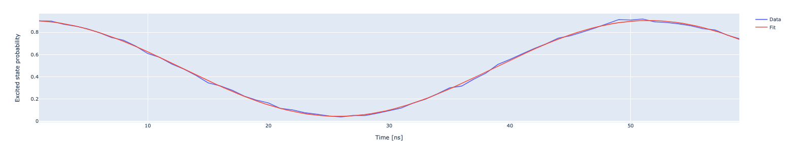

Measure detuning induced by flux pulse
======================================

The frequency of a qubit can be modified by applying a flux pulse. This mechanism is often used to tune
the qubit to a desired frequency. By bringing two qubits closer in frequency it possible to generate natively
gates such as CZ or iSWAP.

In this experiment we measure the detuning with a Ramsey-like sequence where instead of just waiting we apply
a flux pulse of duration :math:`\tau`. The detuning is extracted from the oscillation frequency of the excited
state population.

.. math::
	p_e(t) =\frac{1}{2} \left( 1 + \cos\left(\Delta \omega t \right) \right)

Parameters
^^^^^^^^^^

.. autoclass:: qibocal.protocols.flux_gate.FluxGateParameters
  :noindex:

Example
^^^^^^^

A possible runcard to launch a FluxGate experiment could be the following:

.. code-block:: yaml

    - id: flux_gate
      operation: flux_gate
      parameters:
        duration_min: 10
        duration_max: 100
        duration_step: 10
        flux_pulse_amplitude: 0.2

The expected output is the following:

Requirements
^^^^^^^^^^^^

- :ref:`single-shot`
