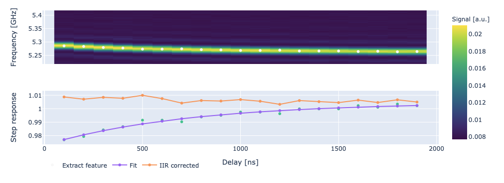

Correcting long-time flux distortions
=====================================

In :ref:`cryoscope` we present how to compute filters to correct distortions on the flux line. With that method
however we are only able to correct distortions with time scales which are limited by the transmon's coherence time :cite:p:`hellings2025calibratingmagneticfluxcontrol, ding2023experimentaladvancesqickquantum`.
However, there are distortions at longer time scales, which are caused by the bias-tee as well as other filters in the flux control line.

In this section we show how to correct for long-time flux distortions with Qibocal.

.. _long-cryoscope:

Cryoscope Spectroscopy
----------------------

In this experiment after fluxing the qubit away from its sweetspot we wait a variable time :math:`\tau` before driving the qubit.
Through a spectroscopy on the drive line we are able to measure the qubit frequency. We expect to observe an exponential rise over time, to the correct frequency value, [due to the bias-tee]. In the protocol, after performing an exponential fit, we compute the corresponding filter
to correct it.

Parameters
^^^^^^^^^^

.. autoclass:: qibocal.protocols.flux_dependence.long_cryoscope.LongCryoscopeParameters
  :noindex:

A possible runcard for this experiment could be the following

Example
^^^^^^^

A possible runcard to launch a Long Cryoscope experiment could be the following:

.. code-block:: yaml

  - id: cryoscope
    operation: long_cryoscope
    parameters:
      duration_max: 2000
      duration_min: 100
      duration_step: 100
      flux_pulse_amplitude: 0.7
      relaxation_time: 50000

The expected output is the following:

Requirements
^^^^^^^^^^^^

- :ref:`single-shot`
- :ref:`flux_amplitude`
