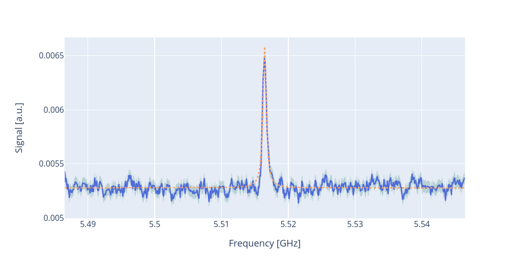
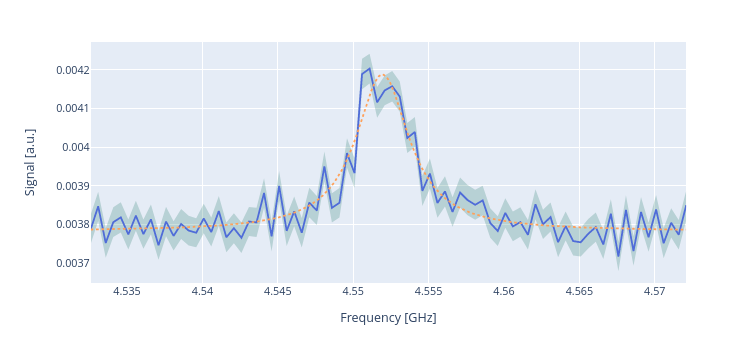

Qubit spectroscopies
====================

In this section we are going to present how to run with qibocal some
qubit spectroscopy experiments.

.. _qubit_spectroscopy:

Qubit Spectroscopy
------------------

To measure the resonance frequency of the qubit it is possible to perform
a `qubit spectroscopy` experiment.
After having obtained an initial guess for the readout amplitude and the readout
frequency through a :ref:`resonator_punchout` this experiment aims at extracting the frequency of the qubit.

In this protocol the qubit is probed by sending a drive pulse at
variable frequency :math:`w` before measuring. When :math:`w` is close
to the transition frequency  :math:`w_{01}` some of the population will
move to the excited state. If the drive pulse is long enough it will be
generated a maximally mixed state with :math:`\rho \propto I` :cite:p:`Baur2012RealizingQG, gao2021practical`.

Parameters
^^^^^^^^^^

.. autoclass:: qibocal.protocols.qubit_spectroscopy.QubitSpectroscopyParameters

How to execute a qubit spectroscopy experiment
^^^^^^^^^^^^^^^^^^^^^^^^^^^^^^^^^^^^^^^^^^^^^^

A possible runcard to launch a qubit spectroscopy experiment could be the following:

.. code-block:: yaml

    - id: qubit spectroscopy 01
      operation: qubit_spectroscopy
      parameters:
        drive_amplitude: 0.01 # drive power
        drive_duration: 4000 # ns
        freq_width: 20_000_000
        freq_step: 1_000_000
        nshots: 1024
        relaxation_time: 20_000

Here is the corresponding plot:

To extract the qubit frequency a Lorentzian fit is performed.
After the post-processing the following parameters will be updated:

* qubit.drive_frequency
* qubit.native_gates.RX.frequency

Requirements
^^^^^^^^^^^^

- :ref:`resonator_spectroscopy`
- :ref:`resonator_punchout`

.. _qubit_spectroscopy_ef:

Qubit spectroscopy for higher excited states
--------------------------------------------

Through a qubit spectroscopy experiment it is possible to target also the transition
frequencies towards higher energy level other than the first excited state.

To visualize these secondary excitations it is necessary to provide a considerable
amount of drive power, which might be outside the limit of the experimental setup.

Another way to address the higher levels is to first excite the qubit to state
:math:`\ket{1}` followed by the sequence previously presented for the qubit spectroscopy.
In this way it is possible to induce a transition between  :math:`\ket{1}\leftrightarrow\ket{2}`.

Such frequency :math:`\omega_{12}` should be below :math:`\omega_{01}` by around :math:`200 - 300` MHz.
From :math:`\omega_{12}` and :math:`\omega_{01}` it is possible to compute the anharmonicity
:math:`\alpha` as :cite:p:`Koch_2007`:

.. math::

    \alpha = \omega_{12} - \omega_{01}

In the literature the energy levels can be expressed as :math:`\ket{g}, \ket{e}, \ket{f}`, to
address the ground state, the excited state and the first excited state above the excited state.
For this reason the experiments has been labelled ``qubit_spectroscopy_ef``.

Parameters
^^^^^^^^^^

.. autoclass:: qibocal.protocols.qubit_spectroscopy_ef.QubitSpectroscopyEFParameters

How to execute a qubit spectroscopy experiment
^^^^^^^^^^^^^^^^^^^^^^^^^^^^^^^^^^^^^^^^^^^^^^

A possible runcard to launch a qubit spectroscopy experiment could be the following:

.. code-block:: yaml

    - id: qubit spectroscopy 12
      operation: qubit_spectroscopy_ef
      parameters:
        drive_amplitude: 0.01 # drive power
        drive_duration: 4000 # ns
        freq_width: 20_000_000
        freq_step: 1_000_000
        nshots: 1024
        relaxation_time: 20_000

Here is the corresponding plot:

To extract :math:`\omega_{12}` a lorentzian fit is performed.

After the post-processing the following parameters will be updated:

* qubit.anharmonicity
* qubit.native_gates.RX12.frequency

Requirements
^^^^^^^^^^^^

- single shot classification
