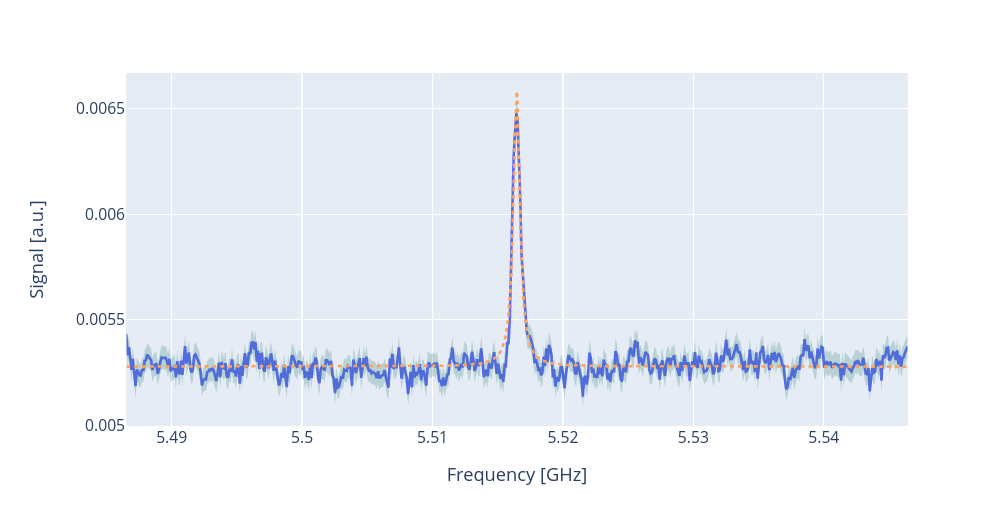
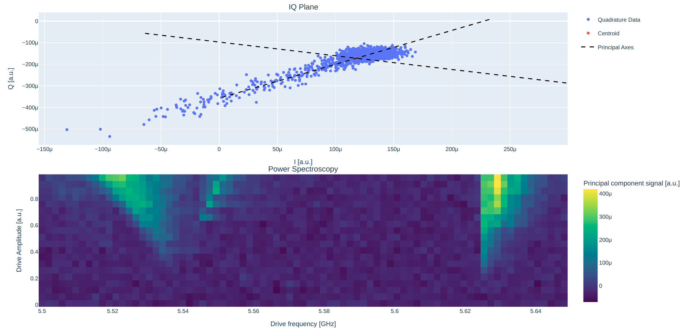
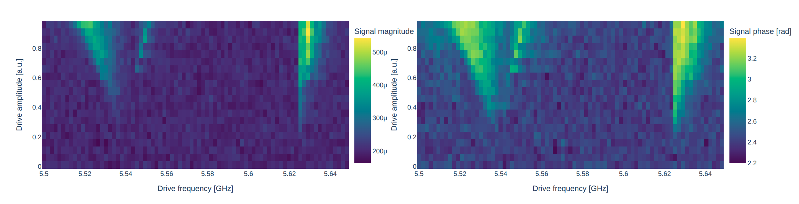
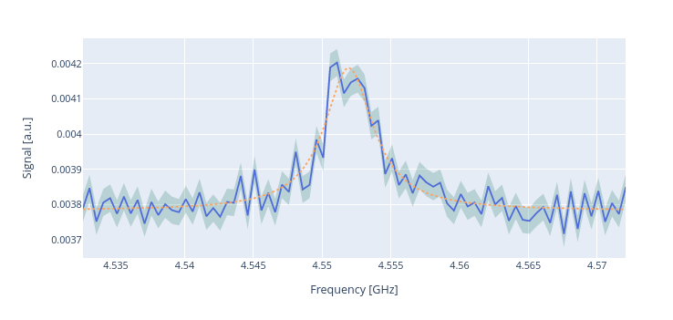

.. _qubit-spectroscopy:

Qubit spectroscopies
====================

In this section we are going to present how to run with qibocal some
qubit spectroscopy experiments.

.. _qubit_spectroscopy:

Qubit Spectroscopy
------------------

To measure the resonance frequency of the qubit it is possible to perform
a `qubit spectroscopy` experiment.
After having obtained an initial guess for the readout amplitude and the readout
frequency through a :ref:`resonator_punchout` this experiment aims at extracting the frequency of the qubit.

In this protocol the qubit is probed by sending a drive pulse at
variable frequency :math:`w` before measuring. When :math:`w` is close
to the transition frequency  :math:`w_{01}` some of the population will
move to the excited state. If the drive pulse is long enough it will be
generated a maximally mixed state with :math:`\rho \propto I` :cite:p:`Baur2012RealizingQG, gao2021practical`.

When the frequency bandwidth measured exceeds the IF bandwidth range (+/- 300 MHz),
the routine automatically splits the sweep into multiple batches, adjusting
the LO frequency accordingly for each batch.

The sweep can be specified directly with ``frequency`` or by setting
``freq_width`` and ``freq_step`` relative to the configured qubit drive
frequency. The drive pulse amplitude and duration can be set with
``drive_amplitude`` and ``drive_duration``.
"""

Parameters
^^^^^^^^^^

.. autoclass:: qibocal.protocols.qubit_spectroscopies.qubit_spectroscopy.QubitSpectroscopyParameters
  :noindex:

How to execute a qubit spectroscopy experiment
^^^^^^^^^^^^^^^^^^^^^^^^^^^^^^^^^^^^^^^^^^^^^^

A possible runcard to launch a qubit spectroscopy experiment could be the following:

.. code-block:: yaml

    - id: qubit spectroscopy 01
      operation: qubit_spectroscopy
      parameters:
        drive_amplitude: 0.01 # drive power
        drive_duration: 4000 # ns
        freq_width: 20_000_000
        freq_step: 1_000_000
        nshots: 1024
        relaxation_time: 20_000

The report includes the IQ plane, the projection along its principal axis, and
the signal magnitude and phase. A Lorentzian fit is performed on the signal
magnitude to extract the qubit frequency. The image below shows the fitted
magnitude trace:

To extract the qubit frequency a Lorentzian fit is performed.

Requirements
^^^^^^^^^^^^

- :ref:`resonator_spectroscopy`
- :ref:`resonator_punchout`

.. _qubit_power_spectroscopy:

Qubit power spectroscopy
------------------------

Qubit power spectroscopy sweeps the drive frequency and amplitude to inspect
how spectral peaks change with drive power. Increasing the amplitude can make
higher-energy transitions visible, and can help distinguish a qubit transition
from other spectral features.

The protocol does not perform a fit. The ``PCA_VARIANCE_THRESHOLD`` constant,
currently set to ``0.85``, determines which plot is shown. If the first
principal component explains more than 85% of the total IQ-data variance, the
plot uses that component; otherwise, it shows signal magnitude and phase as
separate heatmaps.

When the explained-variance ratio is above the threshold, the plot also shows
the IQ data and principal axes:

At or below the threshold, magnitude and phase are plotted separately:

Parameters
^^^^^^^^^^

.. autoclass:: qibocal.protocols.qubit_spectroscopies.qubit_power_spectroscopy.QubitPowerSpectroscopyParameters
  :noindex:

How to execute a qubit power spectroscopy experiment
^^^^^^^^^^^^^^^^^^^^^^^^^^^^^^^^^^^^^^^^^^^^^^^^^^^^^

A possible runcard to launch a qubit power spectroscopy experiment could be
the following:

.. code-block:: yaml

    - id: qubit power spectroscopy
      operation: qubit_power_spectroscopy
      parameters:
        freq_width: 20_000_000
        freq_step: 1_000_000
        min_amp: 0.001
        max_amp: 0.05
        step_amp: 0.001
        duration: 4000 # ns
        nshots: 1024
        relaxation_time: 20_000

The frequency range is centered on the configured drive frequency. Alternatively,
the ``frequency`` and ``amplitude`` parameters can each specify a range directly.

.. _qubit_spectroscopy_ef:

Qubit spectroscopy for higher excited states
--------------------------------------------

Through a qubit spectroscopy experiment it is possible to target also the transition
frequencies towards higher energy level other than the first excited state.

To visualize these secondary excitations it is necessary to provide a considerable
amount of drive power, which might be outside the limit of the experimental setup.

Another way to address the higher levels is to first excite the qubit to state
:math:`\ket{1}` followed by the sequence previously presented for the qubit spectroscopy.
In this way it is possible to induce a transition between  :math:`\ket{1}\leftrightarrow\ket{2}`.

The protocol applies an :math:`RX` pulse to prepare :math:`\ket{1}`, then sweeps
a spectroscopy tone on the qubit's 1-to-2 drive channel before readout. By
default, the sweep is centered on the frequency configured for that channel.
Set ``frequency`` to provide an explicit sweep range, or use ``freq_width`` and
``freq_step`` for a range centered on the configured frequency. As with the
ground-state experiment, ``drive_duration`` and ``drive_amplitude`` control the
spectroscopy pulse.

Such frequency :math:`\omega_{12}` should be below :math:`\omega_{01}` by around :math:`200 - 300` MHz
for flux tunable transmons.
From :math:`\omega_{12}` and :math:`\omega_{01}` it is possible to compute the anharmonicity
:math:`\alpha` as :cite:p:`Koch_2007`:

.. math::

    \alpha = \omega_{12} - \omega_{01}

In the literature the energy levels can be expressed as :math:`\ket{g}, \ket{e}, \ket{f}`, to
address the ground state, the excited state and the first excited state above the excited state.
For this reason the experiments has been labelled ``qubit_spectroscopy_ef``.

Parameters
^^^^^^^^^^

.. autoclass:: qibocal.protocols.qubit_spectroscopies.qubit_spectroscopy_ef.QubitSpectroscopyEFParameters
  :noindex:

How to execute a qubit spectroscopy EF experiment
^^^^^^^^^^^^^^^^^^^^^^^^^^^^^^^^^^^^^^^^^^^^^^^^^

A possible runcard to launch a qubit spectroscopy experiment could be the following:

.. code-block:: yaml

    - id: qubit spectroscopy 12
      operation: qubit_spectroscopy_ef
      parameters:
        drive_amplitude: 0.01 # drive power
        drive_duration: 4000 # ns
        freq_width: 20_000_000
        freq_step: 1_000_000
        nshots: 1024
        relaxation_time: 20_000

The report uses the same IQ, principal-axis, magnitude, and phase panels as
qubit spectroscopy. A Lorentzian fit to the signal magnitude extracts
:math:`\omega_{12}`; the report also includes the fitted frequency and the
calculated anharmonicity. The image below shows the fitted magnitude trace:

After fitting, the anharmonicity is calculated as
:math:`\alpha = \omega_{12} - \omega_{01}`. When updates are enabled, both the
calibrated 1-to-2 transition frequency and the frequency of the ``RX12`` pulse
are updated.

Requirements
^^^^^^^^^^^^

- :ref:`single-shot`
