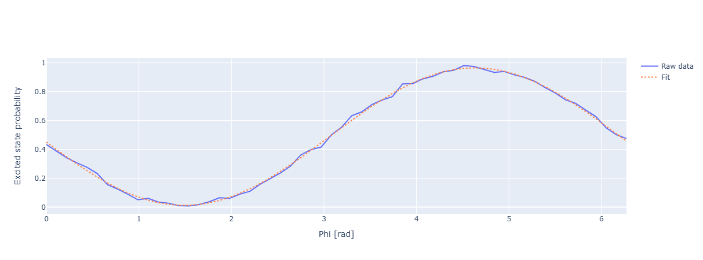

Qubit VZ
========

Applying a flux pulse to a qubit temporarily changes the g-e transition frequency. During this time, in the frame of reference
rotating at qubit parking (usually the sweetspot, but does not need to be) frequency (Bloch sphere) the qubit accumulates a Z
rotation. The Qubit VZ experiment measures this Z rotation angle (modulo :math:`2*pi`). The value of this angle depends on the flux
pulse parameters, on the exact response of the qubit frequency to the pulse, etc., however in this experiment we are not
interested in these topics -- we just measure the overall accumulated angle once the flux pulse is over. In the current implementation
we use a simple rectangular flux pulse, the duration and amplitude of which are user-configurable.

The experiment proceeds as follows:

1. Bring the qubit to the equator of the Bloch sphere via a :math:`\pi / 2` rotation around X axis.
2. Apply the flux pulse.
3. Apply another :math:`\pi / 2` rotation, but sweep its relative phase, i.e. sweep the axis (in X-Y plane) around which the rotation happens.
4. Measure the qubit.

As explained above, step 2. will induce a Z rotation, which throughout this experiment we refer to as virtual Z (VZ) rotation.
Let's denote this VZ rotation angle as :math:`\phi`. Now, on a more abstract level, one instance of this sweep can be described
by the following procedure: :math:`R_{xy}(\pi / 2, \theta)R_z(\phi)R_x(\pi / 2)\vert 0 \rangle`, where :math:`\theta` is the angle that
is beeing swept. It is easy to calculate that the probability of the excited state is proportional to :math:`\cos^2 {\left( \frac{\phi - \theta}{2}\right)}`.
By sweeping :math:`\theta` and measuring the excited state probability we can fit this model and easily extract the value of :math:`\phi`.

Parameters
^^^^^^^^^^

.. autoclass:: qibocal.protocols.qubit_vz.QubitVzParameters
	:noindex:

Example
^^^^^^^
An example runcard for this experiment looks like as follows:

.. code-block:: yaml

    - id: Qubit VZ
      operation: qubit_vz
      parameters:
        duration: 50
        amplitude: 0.15
        nshots: 128

The expected output looks like the following:

Requirements
^^^^^^^^^^^^

For this experiment to succeed, single qubit gates and single shot readout shall be calibrated for the qubit under examination.
