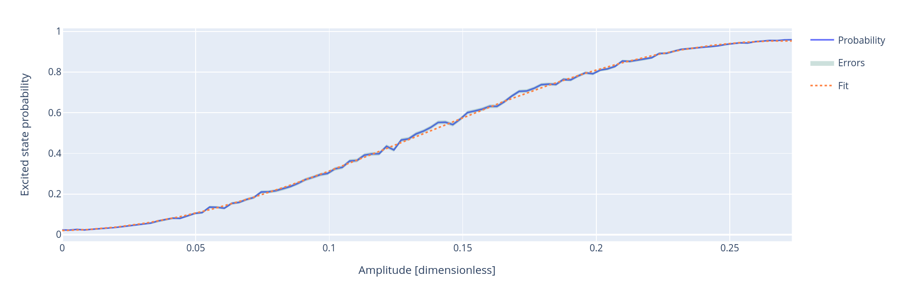
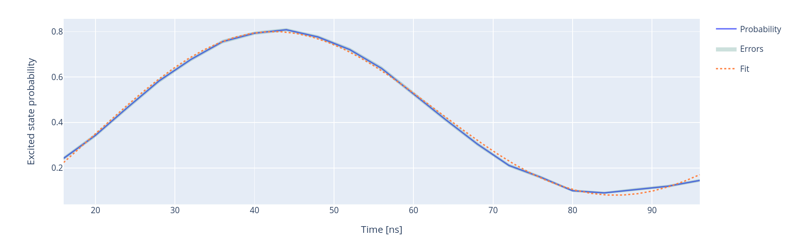
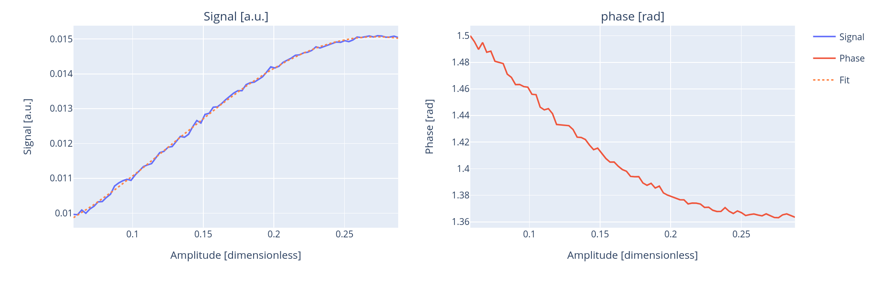
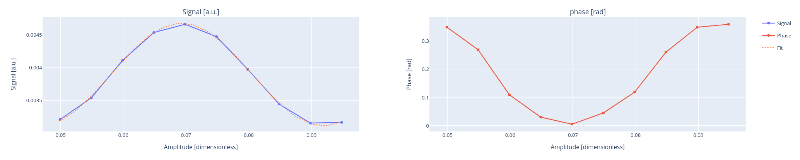

.. _rabi:

Rabi experiments
================

In this section we present all Rabi experiments provided by Qibocal.

Rabi lenght and amplitude
-------------------------

The goal of the Rabi experiment is to tune the amplitude (duration) of the drive pulse, in order
to excite the qubit from the ground state up to state :math:`\ket{1}`.

In the Rabi experiment, the qubit is probed with a drive pulse at the qubit frequency :math:`w_{01}`
before measuring. This pulse sequence is repeated multiple times changing the amplitude (duration) of the pulse.
The qubit starts in the ground state, changing one of the two parameters of the drive pulse, the probability of being in the first
excited state increases following a sinusoidal pattern.

For the amplitude version, we expect:

.. math::
	p_e(t) =\frac{1}{2} \left( 1 - \cos\left(\Omega_R t \right) \right)

For the time version, we have to take into account the dephasing and the energy decay. In case the
Rabi rate is larger than the decay and the pure dephasing rate,

.. math::
	p_e(t) = \frac{1}{2} \left(1- e^{-t/\tau} \cos\left(\Omega_R \frac{t}{2}\right)\right)

where :math:`\Omega_R` is the Rabi frequency and :math:`\tau` the decay time.

Parameters
^^^^^^^^^^

.. autoclass::
	qibocal.protocols.rabi.amplitude.RabiAmplitudeParameters
	:noindex:

.. autoclass::
	qibocal.protocols.rabi.length.RabiLengthParameters
	:noindex:

Example
^^^^^^^
It follows an example of the experiment parameters.

.. code-block:: yaml

    - id: Rabi amplitude
      operation: rabi_amplitude
      parameters:
        min_amp_factor: 0.1
        max_amp_factor: 1.
        step_amp_factor: 0.01
        pulse_length: 40
        nshots: 3000
        relaxation_time: 50000

To run properly this experiment it is important to set the
`relaxation_time` higher than the qubit `T1`.

After running `qq auto`, the experiment is executed and the result will looks like
the following picture.

Regarding the time version of this experiment, this is an example

.. code-block:: yaml

    - id: Rabi length
      operation: rabi_length
      parameters:
        pulse_duration_start: 16
        pulse_duration_end: 100
        pulse_duration_step: 4
        pulse_amplitude: 0.22
        nshots: 3000
        relaxation_time: 50000

For each Rabi experiment Qibocal provides the `signal` version, where just the readout signal is acquired, without
performing state discrimination :class:`qibocal.protocols.rabi.amplitude_signal.rabi_amplitude_signal`,
:class:`qibocal.protocols.rabi.length_signal.rabi_length_signal`.

It follows an example runcard and plot for the signal exepriment

.. code-block:: yaml

    - id: Rabi signal
      operation: rabi_amplitude_signal
      parameters:
        min_amp_factor: 0.2
        max_amp_factor: 1.
        step_amp_factor: 0.01
        pulse_length: 40
        nshots: 3000
        relaxation_time: 50000

Requirements
^^^^^^^^^^^^
- :ref:`qubit_spectroscopy`
- :ref:`resonator_spectroscopy`

Rabi ef
-------

This experiment is used to characterized the :math:`\pi_{12}` pulse, in order to change the qubit state from :math:`\ket{1}`
to :math:`\ket{2}`. The experiment is similar to the Rabi  experiment, but at the beginning the state should be prepared in the
:math:`\ket{1}` state through a :math:`\pi_{01}` pulse.

Example
^^^^^^^

It follows an example of runcard and a generated report.

.. code-block:: yaml

    - id: Rabi ef
      operation: rabi_amplitude_ef
      parameters:
        min_amp_factor: 0.2
        max_amp_factor: 1.
        step_amp_factor: 0.01
        pulse_length: 400
        nshots: 3000
        relaxation_time: 50000

Requirements
^^^^^^^^^^^^

- :ref:`rabi`
