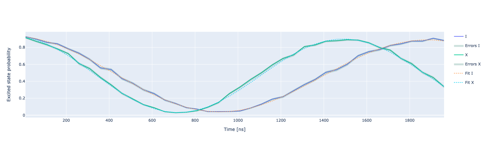

Ramsey experiments
==================

In this section we show how to run Ramsey experiments using Qibocal

.. _ramsey:

Ramsey
------

To measure the decoherence time of a qubit it is possible to perform a Ramsey experiment.
In this protocol two short :math:`\pi /2` are sent separated by a waiting time :math:`\tau`.
The first :math:`\pi /2` pulse will project the qubit from :math:`\ket{0}` onto the xy
plane of the Bloch sphere. During the waiting time :math:`\tau` the qubit will decohere around
the z axis, after the second :math:`\pi /2` we peform a measurement.
By changing the waiting time :math:`\tau` we should observe an exponential decay
in the probability of measuring :math:`\ket{1}` which will give us an estimate of :math:`T_2*`.
In the case where there is a difference between the qubit frequency and the frequency of
the drive pulse the final state will show a sinusoidal dependence from which we can extract
a correction on the qubit frequency :cite:p:`Baur2012RealizingQG`:

.. math::

    p_e = \frac{1}{2} + \frac{1}{2} e^{-\tau/T_2} \cos(\Delta \omega \pm \pi/2)

In order to obtain the correction on the qubit frequency reliably usually the
drive pulse it is detuned on purpose to generate oscillations.

Parameters
^^^^^^^^^^

.. autoclass:: qibocal.protocols.ramsey.ramsey.RamseyParameters

Example
^^^^^^^

A possible runcard to launch a Ramsey experiment could be the following:

.. code-block:: yaml

    - id: ramsey
      operation: ramsey
      parameters:
        delay_between_pulses_end: 2000
        delay_between_pulses_start: 50
        delay_between_pulses_step: 50
        detuning: -1000000
        nshots: 1024

The expected output is the following:

:math:`T_2` and :math:`\Delta \omega` are determined by fitting the output signal using
the formula presented above.

If the protocols is successful the drive frequency will be updated only if a non-zero
detuning is provided. :math:`T_2` is updated only in the case where detuning is not specified.

Requirements
^^^^^^^^^^^^

- :ref:`single-shot`

.. _ramsey_signal:

Ramsey with raw signal
----------------------

A standard Ramsey experiment will try to compute the probability of the qubit
being measured in state :math:`\ket{1}`. It is possible to perform a Ramsey experiment
without performing single shot classification by running an experiment called ``ramsey_signal``.

The acquisition and the fitting procedure are exactly the same, the only difference being
that on the y axis it will be displayed the raw measurements from the instruments.

Parameters
^^^^^^^^^^

.. autoclass:: qibocal.protocols.ramsey.ramsey_signal.RamseySignalParameters

Example
^^^^^^^

.. code-block:: yaml

    - id: ramsey with signal
      operation: ramsey_signal
      parameters:
        delay_between_pulses_end: 25000
        delay_between_pulses_start: 50
        delay_between_pulses_step: 1000
        nshots: 1024

Note that in this case error bars will not be provided.

Measuring the ZZ coupling with a Ramsey experiment
---------------------------------------------------

By repeating the Ramsey experiment while putting one of the neighbor qubits in
state :math:`\ket{1}` we can have an estimate on the ZZ coupling :math:`\zeta`.
The ZZ coupling :math:`\zeta` is a residual interaction which leads to shifts in
the frequency of the qubit when one of the neighbor is in the excited state.
Given that through a Ramsey experiment we can measure carefully the frequency of the qubit,
by comparing the outcome of a standard Ramsey experiment with the outcome when one of the neighbor
qubit is excited we can infer the ZZ coupling term :math:`\zeta`. For superconducting platforms
without tunable couplers such terms is expected to be of the order of a few hundred kHz.

Parameters
^^^^^^^^^^

.. autoclass:: qibocal.protocols.ramsey.ramsey_zz.RamseyZZParameters

Example
^^^^^^^

.. code-block:: yaml

    - id: ramsey zz
      operation: ramsey_zz
      parameters:
        delay_between_pulses_end: 2000
        delay_between_pulses_start: 10
        delay_between_pulses_step: 50
        detuning: 500000
        nshots: 1024
        target_qubit: D1

Requirements
^^^^^^^^^^^^

- :ref:`rabi`
