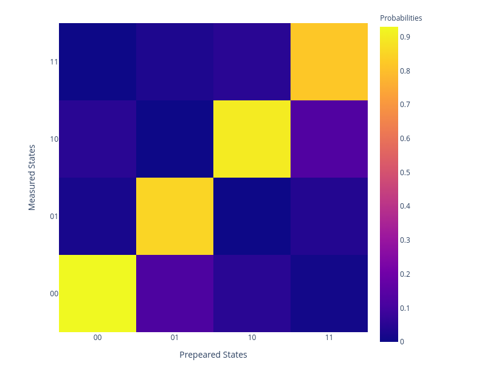

Readout mitigation matrix
=========================

The idea behind this protocol is that we can correct the qubit readout errors
by applying a corrective linear transformation to the readout results, in formula

.. math::
	O_{noisy} = M O_{ideal},

where :math:`O_{noisy}` is the readout probabilities on the noisy device, 
:math:`O_{ideal}` is the expected one and :math:`M` is the readout mitigation matrix.
The matrix :math:`M^{-1}` can be used to correct the noisy readouts.

This protocol evaluates the readout matrix by preparing the qubit(s) in the 
computational base and measuring their states.

Pramateters
^^^^^^^^^^^

.. autoclass:: qibocal.protocols.readout_mitigation_matrix.ReadoutMitigationMatrixParameters
	:noindex:

Example
^^^^^^^

.. code-block:: yaml
	
	- id: readout_mitigation_matrix
	  operation: readout_mitigation_matrix
	  parameters:
	    nshots: 1000
	    pulses: true

After the protocol execution, the result is the following

