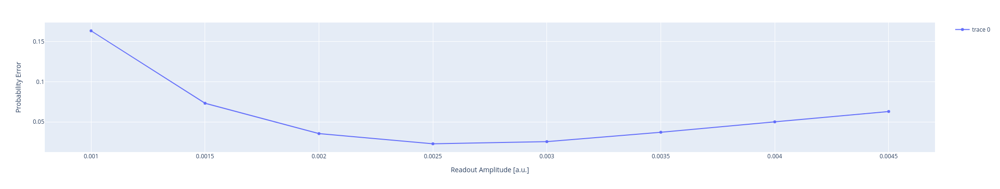

Readout optimization
====================

Qibocal provides a protocol to improve the readout pulse amplitude by optimize 
the assignment fidelity. 

Parameters
^^^^^^^^^^

.. autoclass:: qibocal.protocols.readout_optimization.resonator_amplitude.ResonatorAmplitudeParameters
	:noindex:

Example
^^^^^^^

It follows an example runcard of the resonator amplitude routine with the plot
generated in the report.

.. code-block:: yaml

    - id: resonator_amplitude
      operation: resonator_amplitude
      parameters:
          amplitude_step: 0.0005
          amplitude_start: 0.001
          amplitude_stop: 0.005

As shown in the picture below, the protocol sweeps the readout amplitude and evaluates
the probability errors

