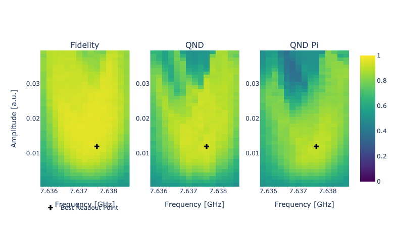

Readout optimization
====================

Qibocal provides different protocols to improve the readout pulse parameters.
Although maximizing the assignment fidelity could be an option, this metric favors configuration
with high readout amplitude which can lead to excitations out of the computational basis.
A better metric, which we are going to use in the experiments below consists in maximizing the average QND
which is defined following  :cite:p:`Chen_2022`.

Resonator Amplitude
-------------------

Parameters
^^^^^^^^^^

.. autoclass:: qibocal.protocols.readout_optimization.amplitude.ReadoutAmplitudeParameters
	:noindex:

Example
^^^^^^^

It follows an example runcard of the resonator amplitude routine with the plot
generated in the report.

.. code-block:: yaml

    - id: readout_amplitude_optimization
      operation: readout_amplitude_optimization
      parameters:
          amplitude_step: 0.001
          amplitude_min: 0.001
          amplitude_max: 0.1

As shown in the picture below, the protocol sweeps the readout amplitude and evaluates the errors probability.

.. image:: readout_amplitude.png

Resonator Frequency
-------------------

Parameters
^^^^^^^^^^

.. autoclass:: qibocal.protocols.readout_optimization.frequency.ReadoutFrequencyParameters
	:noindex:

Example
^^^^^^^

In the following we show a possible runcard for the optimization of the resonator frequency together with expected output plot.

.. code-block:: yaml

    - id: readout_frequency_optimization
      operation: readout_frequency_optimization
      parameters:
        freq_width: 3_000_000
        freq_step: 200_000

.. image:: frequency_optimization.png

Resonator Optimization
----------------------

Parameters
^^^^^^^^^^

.. autoclass:: qibocal.protocols.readout_optimization.optimization.ReadoutOptimizationParameters
	:noindex:

Example
^^^^^^^

A possible runcard for the resonator optimization protocol could be:

.. code-block:: yaml

    - id: readout_optimization
      operation: readout_optimization
      parameters:
        freq_width: 3_000_000
        freq_step: 125_000
        amplitude_step: 0.00025
        amplitude_start: 0.00025
        amplitude_stop: 0.0085
        delay: 1000

The plot generated by the report should be similar to the following one:

