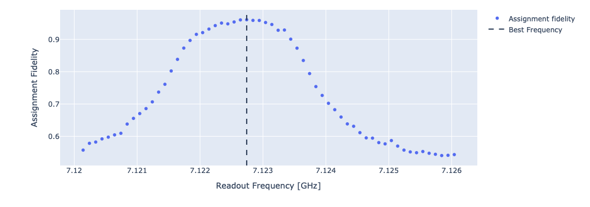

Readout optimization
====================

Qibocal provides different protocols to improve the readout pulse parameters by optimizing the assignment fidelity.

Resonator Amplitude
-------------------

The resonator amplitude protocol improves the readout amplitude by optimizing the assignment fidelity.

Parameters
^^^^^^^^^^

.. autoclass:: qibocal.protocols.readout_optimization.amplitude.ReadoutAmplitudeParameters
	:noindex:

Example
^^^^^^^

It follows an example runcard of the resonator amplitude routine with the plot
generated in the report.

.. code-block:: yaml

    - id: readout_amplitude_optimization
      operation: readout_amplitude_optimization
      parameters:
          amplitude_step: 0.001
          amplitude_min: 0.001
          amplitude_max: 0.1

As shown in the picture below, the protocol sweeps the readout amplitude and evaluates the errors probability.

Resonator Frequency
-------------------

The resonator frequency protocol performs a sweep of the readout frequency to maximize assignment fidelity.

Parameters
^^^^^^^^^^

.. autoclass:: qibocal.protocols.readout_optimization.frequency.ReadoutFrequencyParameters
	:noindex:

Example
^^^^^^^

In the following we show a possible runcard for the optimization of the resonator frequency together with expected output plot.

.. code-block:: yaml

    - id: readout_frequency_optimization
      operation: readout_frequency_optimization
      parameters:
        freq_width: 3_000_000
        freq_step: 200_000

Resonator Optimization
----------------------

In addition to this metric, the protocol also computes the quantum non-demolition-ness (QND) of the measurement, which serves to evaluate measurement-induced state disturbance.
To capture leakage outside the computational basis the protocol includes the computation of QND with an additional :math:`\pi` pulse.
Readout parameters are then updated based on the configuration that yields the highest assignment fidelity.

Parameters
^^^^^^^^^^

.. autoclass:: qibocal.protocols.readout_optimization.resonator_optimization.ResonatorOptimizationParameters
	:noindex:

Example
^^^^^^^

A possible runcard for the resonator optimization protocol could be:

.. code-block:: yaml

    - id: resonator optimization
      operation: resonator_optimization
      parameters:
        freq_width: 3_000_000
        freq_step: 125_000
        amplitude_step: 0.00025
        amplitude_start: 0.00025
        amplitude_stop: 0.0085
        delay: 1000

The plot generated by the report should be similar to the following one:

.. image:: resonator_optimization.png
