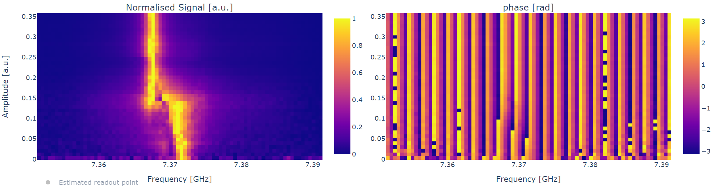

Resonator punchout
==================

With the resonator spectroscopy at high power we found the bare resonator frequency
(also called high power frequency), but this is not the frequency that will be used in measurements.
We need to find the frequency in the low power regime, where the resonator is actually coupled
to the qubit. To do that, we first have to find the correct amplitude of the readout pulse.
Also this experiment can be initially performed with a VNA, to check everything is
working and to obtain a rough estimation of the parameters to be used by the control devices.
We do again a resonator spectroscopy experiment, measuring at different frequencies,
but this time scanning in a narrow frequency span and also for different pulse amplitudes.
We expect the resonator frequency to have a strong dependency on the amplitude: in
particular we expect it to be fixed at first (in the high power regime) then undergo a
transition phase and then be fixed again at a different frequency because of the coupling
with the qubit.

This is and example of a runcard for a resonator punchout:

.. code-block:: yaml

    platform: <platform_name>

    qubits: [0]

    actions:

      - id: resonator punchout
        priority: 0
        operation: resonator_punchout
        parameters:
          freq_width: 40_000_000
          freq_step: 500_000
          amplitude: 0.03
          min_amp_factor: 0.1
          max_amp_factor: 2.4
          step_amp_factor: 0.3
          nshots: 2048
          relaxation_time: 5000

Eventually, we want to have a plot like the one below:

This experiment is the first one where we actually are "seeing" the qubit and it's
extremely important also to check that the qubit is working properly.
During a characterization, various experimental problems can happen and can lead the experimenter
to believe that the qubit is no longer working: this experiment gives us an easy way to check it.

Compared to a low power resonator spectroscopy, with punchout we can see the shift in the resonator frequency
and thus ensure that we are in the low power regime.

Moreover, from this experiment we can actually already have an estimate of the qubit
frequency using:

.. math::

   \omega_{rh} - \omega_{rl} = \chi = \frac{g^2}{\Delta}

Where :math:`\Delta = \omega_{rl} - \omega_q`.
So, if we know, maybe from design specifications, the expected value of :math:`g`, we can
have an estimate of the qubit frequency. If, as in most cases, we don't have information
on :math:`g`, then we still can infer if the qubit frequency is higher or lower than the resonator
frequency.

To obtain a clear plot, this experiment usually requires multiple tries, to choose
"good parameters". In particular:

* the amplitude range and step must be chosen carefully because punchout can lead to extremely long experiments (that we would like to avoid), but large steps will inevitably confuse the plot;
* the frequency usually shifts very little, but depending on :math:`g` and :math:`\Delta`, so it is difficult to set the frequency span and step;
* if the scan in amplitude is linear, it will be difficult to have a clear view of all the three regimes at the same time. If it is possible, it may be worth to do a logarithmic scan.

Note also that, in literature, this plot is often presented as a scan in the attenuation
of the readout line. The effect is the same as of changing the amplitude (although it is
by default a logarithmic scan), but the plot is reversed: at the top (high attenuation)
we will see the low power regime and at the bottom (low attenuation) the high power
one.

Note that in the plots measured amplitudes are normalized for every readout amplitude and we
actually have very high amplitudes in high power, and much lower amplitude elsewhere.
From these plots we can extract few things:

* the pulse amplitude that we will use for the next experiments for the readout pulse;
* the peak frequency (ground state frequency).

We should try to use the amplitude that maximizes the signal to noise (S/N) ratio for the resonator, so in general the highest
amplitude at low power. However, we still need to be sure to not enter the transition
regime, something that could lead to very noisy experiments and eventually prevent us
to reach any sensible result. To be sure that, at the given pulse amplitude, we are not
in the transition regime, we can repeat the standard resonator spectroscopy with a finer
scan, checking if the peak is Lorentzian.
A resonator spectroscopy is also useful to better check the resonator frequency at low
power. We can alse write down the maximum value of the peak.
Since we are not interacting directly with the qubit, we are effectively measuring the
amplitude of the ground state and, from now on we will not change the resonator frequency,
so we expect to always measure this amplitude for the zero state. Here it is
not needed to do a precise measurement, but it is nevertheless very useful to have an
approximate value, that can later be used to check, in other experiments, that we are
not exciting the qubit by error (if we see a change in amplitude, then maybe the qubit
state has changed).
