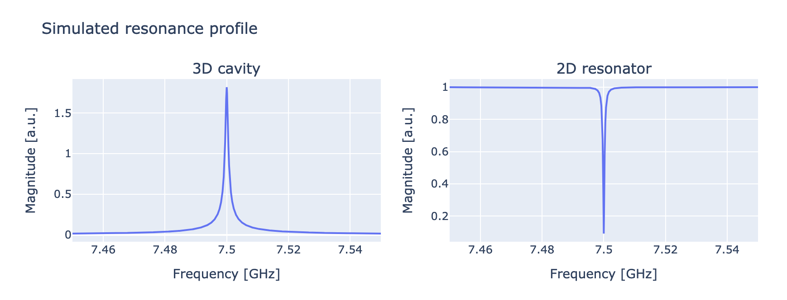
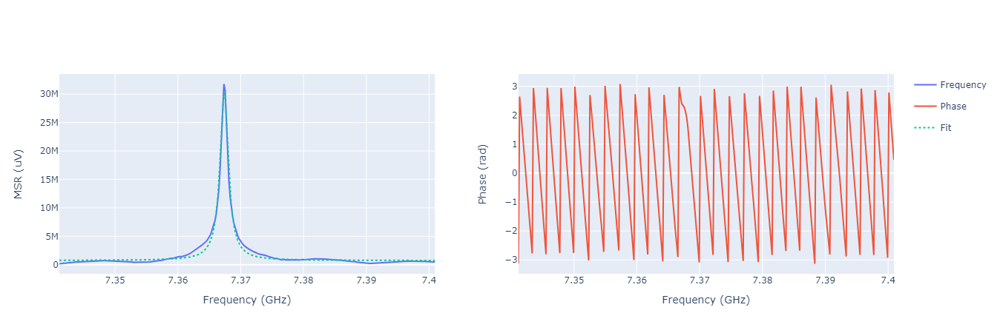
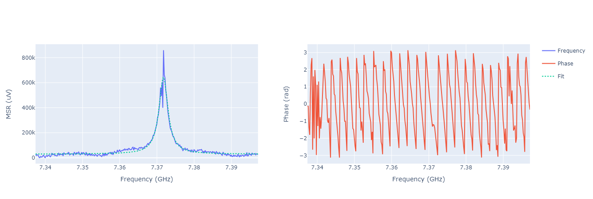
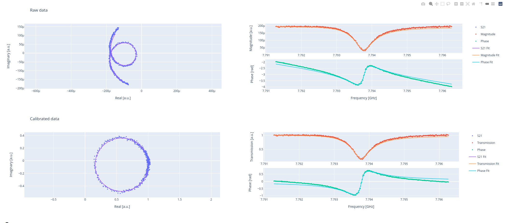

.. _resonator_spectroscopy:

Resonator spectroscopy
======================

When calibrating the readout pulse, the first step is to identify the resonator frequency.
At this frequency, we can observe a clear difference in the transmitted signal: for a 3D cavity resonator,
an amplified signal will be observed, whereas for a 2D resonator, higher absorption will be spotted.
In both cases, a Lorentzian peak is expected, which will be positive for 3D cavities and negative for 2D resonators.

In the experiment, we send a readout pulse with a fixed duration and amplitude.
After waiting for the time of flight, we acquire and average a waveform, resulting in a single point.

Parameters
^^^^^^^^^^

.. autoclass:: qibocal.protocols.resonator_spectroscopy.ResonatorSpectroscopyParameters
  :noindex:

This experiment is highly dependent on the pulse amplitude. The primary goal is to determine the resonator frequency
without any readout optimization, which will be addressed later.
For this purpose, we can fix the pulse duration to the order of magnitude of microseconds.
The discussion regarding amplitude is more complex and involves several considerations:

* higher amplitudes usually correspond to a better signal-to-noise ratio;
* at high amplitudes the signal breaks superconductivity, therefore resonator is not effectively not coupled to the qubit (we talk of bare resonator frequency);
* at intermediate amplitudes the peak could completely disappear and is, in general, not Lorentzian;
* very high amplitudes could damage the components.

The bare resonator frequency can be found by setting a large value for the amplitude, e.g.:

Example
^^^^^^^

.. code-block:: yaml

      - id: resonator_spectroscopy high power

        operation: resonator_spectroscopy
        parameters:
            freq_width: 60_000_000
            freq_step: 200_000
            amplitude: 0.6
            power_level: high
            nshots: 1024
            relaxation_time: 100000

.. note::
    The resonator spectroscopy experiment will be performed by computing
    the average on hardware. If the user wants to retrieve all the shots
    and perform the average afterward it can be done by specifying the
    entry hardware_average: false in the experiment parameters. In this
    case, the fitting procedure will consider errors and error bands
    will be included in the plot.

    .. image:: resonator_spectroscopy_error_bars.png

Lowering the amplitude we can see a shift in the peak, e.g.:

Example
^^^^^^^

.. code-block:: yaml

      - id: resonator_spectroscopy low power

        operation: resonator_spectroscopy
        parameters:
            freq_width: 60_000_000
            freq_step: 200_000
            amplitude: 0.03
            power_level: low
            nshots: 1024
            relaxation_time: 100000

Running the ``qibocal`` routines above produces outputs in the reports like the ones shown above.
The peaks are Lorentzian. However, a better description for a 2D notch resonator resonance profile is provided by
:cite:p:`Gao2008, Probst2015` where the complex signal is modeled as

.. math::

  S_{21}(f) = ae^{i\alpha}e^{-2\pi i f \tau}\left[ 1 - \frac{(Q_l/|Q_c|)e^{i\phi}}{1 + 2iQ_l(f/f_r -1)} \right]

This description gives insightful information, the first part describes the environment which involves:

* :math:`a`: amplitude resulting from the attenuation and gain in the measurement system;
* :math:`\alpha`: phase-shift associated with :math:`a`;
* :math:`\tau`: cable delay caused by the length of the cable and the finite speed of light.

The second part describes the resonance of an ideal 2D notch resonator:

* :math:`Q_l`: loaded (total) quality factor;
* :math:`Q_c`: coupling (external) quality factor;
* :math:`\phi`: accounts for impedance mismatches or reflections in cables (Fano interferences);
* :math:`f_r`: resonance frequency.

The routine should be preferred over the Lorentzian fit because it exploits all the information in a signal, including both magnitude and phase.
Nonetheless, performing a direct fit for all seven parameters simultaneously involves handling a nonlinear multi-parameter fitting problem,
which is non-robust and extremely sensitive to the initial values. Therefore, the problem is divided into several independent fitting tasks to
enhance robustness and accuracy:

* Cable delay correction: the cable delay titls the phase signal by a slope :math:`2\pi\tau` and to get a rough estimate, it is
  sufficient to fit a linear function to the phase signal. Without any cable delay, the resonance looks like a circle in the complex
  plane but the cable delay deforms this circle to a loop-like curve.
* Circle fit: the center and radius of the circle resulting from the previous step are evaluated. The routine expolits the methods
  described in :cite:p:`Chernov2005`. The data are shifted to the found center.
* Phase fit: the phase angle :math:`\theta` of the centered data as a function of frequency is fit with the following profile

.. math::

  \theta = \theta_0 - 2\pi \tau (f-f_r) + 2 \arctan \left[2 Q_r \left( 1 - \frac{f}{f_r} \right) \right]

The linear background slope accounts for an additional residual delay :math:`2\pi\tau(f - f_r)`, introducing an extra degree of freedom to the parameter set.
Parameter estimation is performed through an iterative least squares process to optimize the model parameters.

Example
^^^^^^^
.. code-block:: yaml

      - id: resonator_spectroscopy low power

        operation: resonator_spectroscopy
        parameters:
            freq_width: 20_000_000
            freq_step: 100_000
            amplitude: 0.01
            power_level: low
            nshots: 1024
            relaxation_time: 100_000
            fit_function: "s21"

.. note::
    The `s21` routine provides a comprehensive report of the calibration and parameter estimation process.
    In the first row, the raw data are shown in the complex plane, typically distributed as a loop-like curve.
    To the right, the magnitude and phase of the signal of interest are presented. In the second row, after removing the environmental effects,
    the calibrated data are displayed, which should be approximately distributed as a circle in the complex plane.

    .. image:: resonator_spectroscopy_error_bars.png

Example
^^^^^^^

As expected, at low power the resonator frequency shifts.
This is due to the Hamiltonian of the system :cite:p:`Blais_2004, wallraff2004strong`. Therefore, the dressed resonator
frequency is larger than the bare resonator frequency.

Lowering the amplitude value also reduces the height of the peak and increases the noise.

Another parameter connected to the amplitude, is also the relaxation time (in some
literature also referred to as repetition duration) and the number of shots.
The number of shots represents the number of repetitions of the same experiment (at the same
frequency), while the relaxation time is the waiting time between repetitions. A higher
number of shots will increase the S/N ratio by averaging the noise, but will also slow
down the acquisition.
As per the relaxation time, for this experiment in particular we
can leave it at zero: since we are not exciting the qubit we do not particularly care
about it. However note that, for 3D cavities, we could end up damaging the qubit if we
send too much energy over a small period of time so it could be worth increasing the
relaxation time. However, some electronics do not support zero relaxation times, therefore
a relaxation time greater than zero is a safer choice.

Last but not least, we have to choose which frequencies are probed during the scan:
a very wide scan can be useful if nothing is known about the studied resonator, but in
general, we have at least the design parameters. These are often not exact but can give
an idea of the region to scan (for standard cavities around 7 GHz). Also, a very small
step between two subsequent frequency points is not needed and could really slow down
the experiment (from seconds to tens of minutes) if chosen incorrectly. Usually, a step
of 200 MHz is fine enough.

The resonator frequencies can be then inserted into the platform runcards (in ``qibolab_platforms_qrc``).
For example, if we are reading qubit 0:

.. code-block:: yaml

    native_gates:
        single_qubit:
            0: # qubit number
                RX:
                    duration: 40
                    amplitude: <high_power_amplitude>
                    frequency: <high_power_resonator_frequency>
                    shape: Gaussian(5)
                    type: qd # qubit drive
                    relative_start: 0
                    phase: 0
                MZ:
                    duration: 2000
                    amplitude: <low_power_amplitude>
                    frequency: <low_power_resonator_frequency>
                    shape: Rectangular()
                    type: ro # readout
                    relative_start: 0
                    phase: 0

and also here:

.. code-block:: yaml

    characterization:
        single_qubit:
            0:
                bare_resonator_frequency: <high_power_resonator_frequency>
                readout_frequency: <low_power_resonator_frequency>

Requirements
^^^^^^^^^^^^

- :ref:`Time Of Flight`
