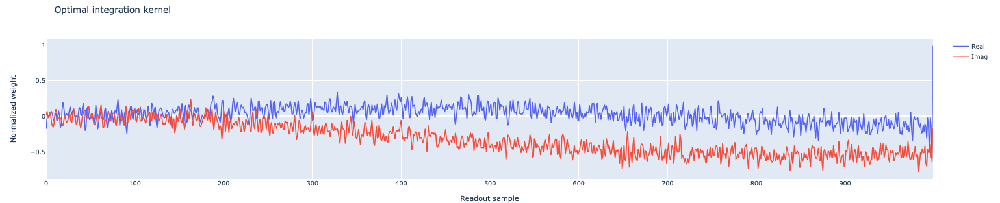

Calibrate Discrimination Kernels
================================

This experiment is quite similar to the :ref:`Time Of Flight` experiment but has a different objective.

In the time-of-flight experiment, we were only interested in the timing of the pulse, regardless of the current qubit state. Here, on the other hand, we want to build a "vector of weights," with a value for each point in the measurement,
to maximize the differences between :math:`\ket{0}` and :math:`\ket{1}`. Points that are further away, considering the two states, are given a higher weight since they are "more interesting" for discrimination purposes.
The trace are acquired assuming that the samples are not demodulated, and the demodulation is done in the fitting procedure.

Parameters
^^^^^^^^^^

.. autoclass:: qibocal.protocols.signal_experiments.calibrate_state_discrimination.CalibrateStateDiscriminationParameters
  :noindex:

Example
^^^^^^^

.. code-block:: yaml

    - id: calibrate kernels                     # custom ID of the experiment
      operation: calibrate_state_discrimination # unique name of the routine
      parameters:
        nshots: 1024
        relaxation_time: 20_000

In the fitting procedure the traces acquired for the ground and the excited are demodulated and with a low-pass filter we remove fast oscillating terms.
The optimal kernel is then calculated by taking the conjugate of the differences of the two demodulated traces. The kernel is also updated in the platform runcard after successful fitting.

Requirements
^^^^^^^^^^^^

This experiment requires the calibration of a pi-pulse, since in the pulse sequence, we need to use the X gate.
Therefore, before this experiment, we need to run at least a:

- :ref:`rabi`
