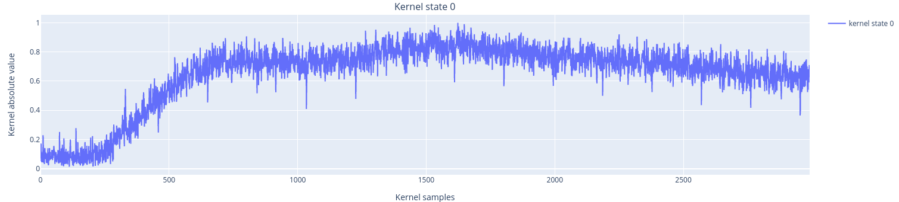

Calibrate Discrimination Kernels
================================

This experiment is quite similar to the time-of-flight experiment but has a different objective.

In the time-of-flight experiment, we were only interested in the timing of the pulse, regardless of the current qubit state. Here, on the other hand, we want to build a "vector of weights," with a value for each point in the measurement, to maximize the differences between :math:`\ket{0}` and :math:`\ket{1}`. Points that are further away, considering the two states, are given a higher weight since they are "more interesting" for discrimination purposes.

How to Execute the Experiment
^^^^^^^^^^^^^^^^^^^^^^^^^^^^^

.. code-block:: yaml

    - id: calibrate kernels                     # custom ID of the experiment
      operation: calibrate_state_discrimination # unique name of the routine
      parameters:
        nshots: 1024
        relaxation_time: 20_000

Acquisition
^^^^^^^^^^^

The acquisition procedure is described in :func:`qibocal.protocols.signal_experiments.calibrate_state_discrimination._acquisition`. It is important to note that this experiment makes use of the RAW acquisition mode, which may require some specific care depending on the instrument employed.

Fit
^^^

The fit procedure (:func:`qibocal.protocols.signal_experiments.calibrate_state_discrimination._fit`) uses the numpy conjugate function, as it takes the conjugate of the differences of the two RAW traces acquired (one for the ground state and one for the excited state) as the kernel, after normalization.

The kernel is also updated in the platform runcard after successful fitting.

Requirements pre-experiment
^^^^^^^^^^^^^^^^^^^^^^^^^^^

This experiment requires the calibration of a pi-pulse, since in the pulse sequence, we eed to use the X gate.
Therefore, before this experiment, we need to run at least a:

- Rabi experiment (ADD LINK TO DOC)
