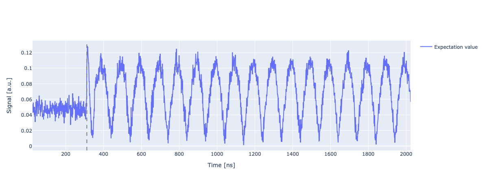
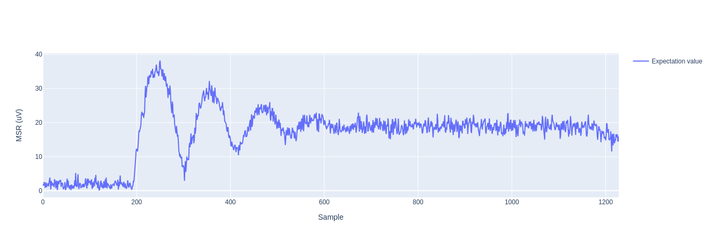
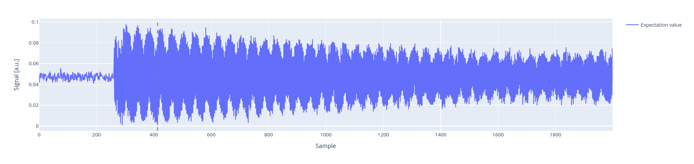

.. _Time Of Flight:

Time Of Flight (Readout)
========================

In this section, we present the time-of-flight experiment for qibocal (see Fig.12 :cite:p:`gao2021practical`).

In the `time of flight` experiment, we measure the time it takes for a readout pulse to travel to the qubit and back, being acquired by the control instrument ADCs.

Carefully calibrating this delay time is important to optimize the readout. In particular, it is useful to acquire just for the duration of the readout pulse, where differences between the two states really appear (both in amplitude and phase).

Parameters
^^^^^^^^^^

.. autoclass:: qibocal.protocols.signal_experiments.time_of_flight_readout.TimeOfFlightReadoutParameters
  :noindex:

How to execute the experiment
^^^^^^^^^^^^^^^^^^^^^^^^^^^^^

.. code-block:: yaml

    - id: time of flight experiment      # custom ID of the experiment
      operation: time_of_flight_readout  # unique name of the routine
      parameters:
        readout_amplitude: 1             # usually high
        window_size: 10
        nshots: 1024
        relaxation_time: 20_000

Although it is possible to avoid setting a specific readout amplitude, it is generally useful to set a high value here. Indeed, we are not looking for the optimal amplitude but want to have a signal with enough power so that it is clear when it starts.

Acquisition
^^^^^^^^^^^

.. testcode::
   :hide:

   from qibolab.execution_parameters import AcquisitionType

It is important to note that this experiment makes use of the RAW acquisition mode (see `Qibolab documentation <https://qibo.science/qibolab/stable/api-reference/qibolab.html#qibolab.execution_parameters.AcquisitionType>`_), which may require some specific care depending on the instrument employed (for some devices demodulation could be used, or this mode could be available for just a single qubit at a time).

For a 3D cavity we expect a plot (considering demodulation) as the following:

In this image, for example, we can see that the fit procedure did not find the correct pulse starting point (that is around 200). This could be improved increasing the window size.

For a 2D resonator, some more oscillation could appear:

Just as an example, we provide here also a plot for a 2D resonator case, where the demodulation is not carried out.
As we can see the plot is very different, but the starting point of the signal is still clearly visible.

Fit
^^^

The fit procedure (:func:`qibocal.protocols.signal_experiments.time_of_flight_readout._fit`) employs a moving average, returning the time when it is maximum, namely when the signal starts being acquired.

Requirements
^^^^^^^^^^^^

Before this experiment, nothing in particular is required. This can indeed be done as a first test of the connections.
