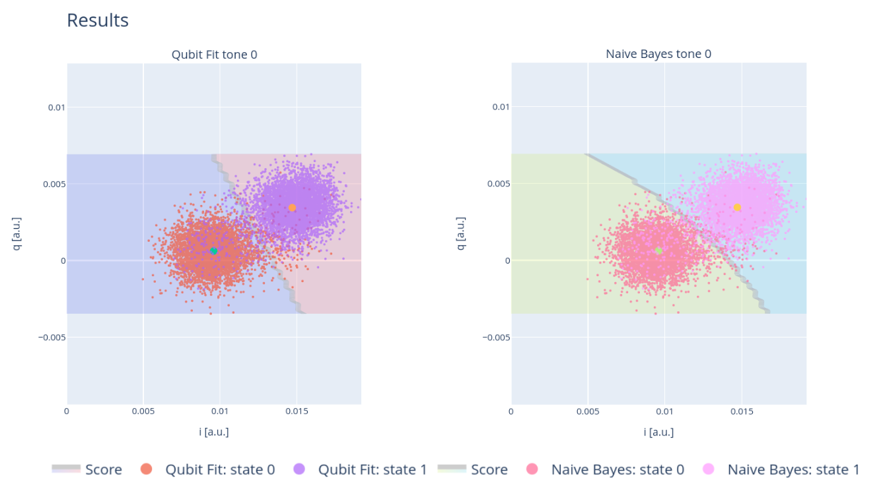

.. _single_shot:
Single Shot Experiments
=======================

In this section we describe the single single shot exepriments for qubit and qutrits.

Qubit Single Shot
-----------------

Acquisition
^^^^^^^^^^^

In this experiment, the qubit is preapared multiple times in state :math:`\ket{0}` and :math:`\ket{1}`,
for each shot the  `I` and `Q` values are acquired. According to the theory, if we take into account
the noise, for each state we should observe a Gaussian blob in the `IQ-plane`:cite:`Krantz_2019`.

Fit
^^^
This method evaluates the axis which passes through the centroids of the two clusters in
the training set, and determines the optimal threshold that maximizes the difference between
the cumulative distributions of the projections along the axis. Predicting the state of a new
point involves determining its relative position to the threshold based on its projection along
the axis. Due to its small complexity, it has high interpretability, but it does not evaluate the
probabilities.

This line is defined in terms of the `angle` :math:`\theta` and `threshold` coordinates. The first one is the angle in radiants formed by the line
connecting the centers of the blobs and the Q-axis. After performing the rotation with angle :math:`-\theta` and translating such that the coordinate
center coincides with the ground state Gaussian center, the `threshold` is the distance from the center along x-axis that maximize the fidelity.

.. math::

	\mathcal{F} = 1 - \frac{1}{2} (P(0,1) + P(1,0))

where :math:`P(i,j)` is the probability of measuring the qubit in state `i` but prepeared in state `j`.
With this routine is possible to train different classifiers, plot their ROC curves and evaluating the Area Under the Curves
all the options are explained into the details in :class:`qibocal.protocols.classification.SingleShotClassificationParameters`.

Example
^^^^^^^

A possible choice of parameters is the following

.. code-block:: yaml

    - id: single shot classification
      operation: single_shot_classification
      parameters:
        nshots: 5000

the result should looks like this

Requirements
^^^^^^^^^^^^

- :ref:`rabi`
