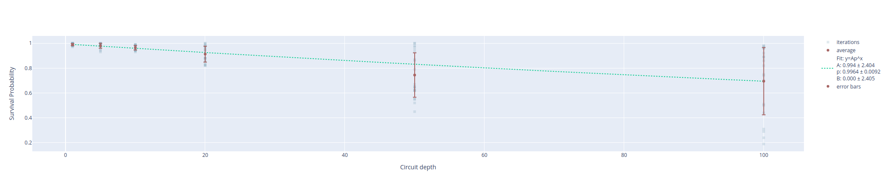

Standard Randomize Benchmarking
===============================

An approach to obtain the average gate fidelity is to perform randomized
benchmarking :cite:p:`Emerson_2005`.
The key idea is that if we average the error process over the uniform space of
unitaries the result is a depolarizing channel that maps any pure state to the
maximally mixed state.
Such uniform space of unitaries is known as *Haar measure*.
It can be shown :cite:p:`Emerson_2005` that the average induced error is proportional
to the depolarization probability.
However, this approach is inefficient because we sample randomly from the Haar measure.
A simplification was proposed in :cite:p:`Knill2008` by restricting the unitaries
to the Clifford group, which consists of unitary rotations mapping the group
of Pauli operators in itself.
Among the advantages of such group are the fact of the number of Clifford
gates is finite given the Hilbert space and being a group we can easily found
the inverse within the group.
The generic procedure to perform a randomized benchmarking is the following:

1. initialize the system in ground state
2. for each sequence length :math:`m` draw sequence of Clifford group elements
3. calculate inverse gate
4. measure sequence and inverse gate
5. repeat the process for multiple sequence of same length and varying the length

The previous approach works because it has been shown :cite:p:`Nielsen_2002` that
randomization with Clifford gates provides again a depolarized noise channel

.. math::
    :name: eq:1

    \rho \rightarrow \frac{d}{2} I + ( 1 - d) \rho

with depolarization probability :math:`d`.
If we follow the previous procedure and we measure the survival probability, i.e.
the probability of measuring the qubit in :math:`\ket{0}`, for
different sequence length :math:`m` we expect the following behavior

.. math::
    :name: eq:2

    F(m) = A p^m + B

where :math:`1-p` is the rate of depolarization while :math:`A` and :math:`B`
capture state preparation and measurement errors.
Finally, we can extract the average error per Clifford as

.. math::
    :name: eq:3

    \epsilon_\text{Clifford} = \frac{1 - p}{1 - 2^{-n}}

where :math:`n` is the number of qubits. The error per gate can be derived by dividing
the Clifford error by the physical gates per Clifford which usually is 1.875.
One of the main feature of RB is the possibility to estimate the gate fidelity
alone without taking into account both state preparation and measurement errors
which can be computed using the :math:`A` and :math:`B` terms in :ref:`Eq. 2 <eq:2>`.

Parameters
^^^^^^^^^^

.. autoclass::
	qibocal.protocols.randomized_benchmarking.standard_rb.StandardRBParameters
	:noindex:

Example
^^^^^^^

It follows a runcard where we execute a standard RB.

.. code-block:: yaml

    - id: standard rb
      operation: standard_rb
      parameters:
        depths: [1,5,10,20,50,100]
        niter: 20
        nshots: 100

The expected output is the following:

