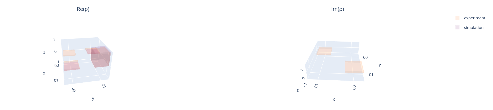
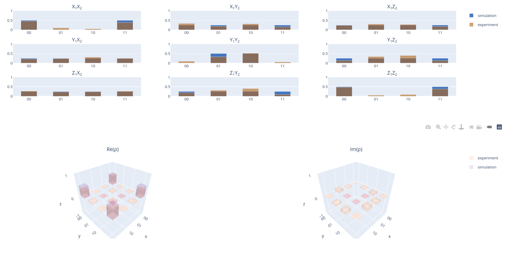

State Tomographies
==================

Parameters
^^^^^^^^^^

.. autoclass::
	qibocal.protocols.tomographies.state_tomography.StateTomographyParameters
	:noindex:

Example
^^^^^^^

Below is an example runcard for this experiment.

.. code-block:: yaml

    - id: state_tomography
      operation: state_tomography
      parameters:
        nshots: 1024
        relaxation_time: 200000

The expected output is the following:

Qibocal also provides two qubit state tomography.

.. code-block:: yaml

     - id: tomography
       operation: two_qubit_state_tomography
       parameters:
         nshots: 5000

The report will look like the following.

