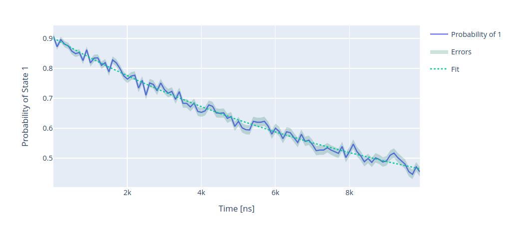
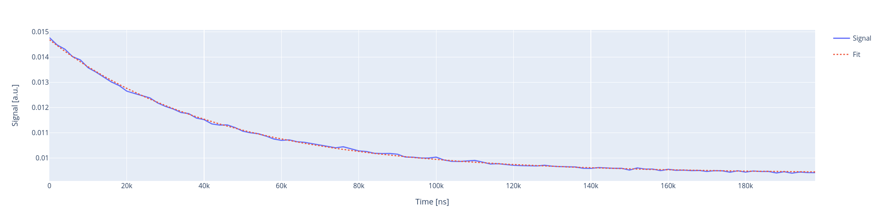

.. _t1:

T1 experiments
==============

In this section we show how to run T1 experiments.

T1
--

Due to coupling to the environment the qubit in state :math:`\ket{1}`
will decay to the state :math:`\ket{0}`. To measure such decay we can perform
a simple experiment by initializing the qubit in :math:`\ket{1}` through a
:math:`\pi`-pulse previously calibrated, we then measure the population of
the excited state for different waiting times :math:`\Delta \tau`.
We expect to measure an exponential decay which is fitted with the following formula:

.. math::

    p_e(t) = A + B  e^{ - t / T_1}

:math:`A` and :math:`B` are introduced to improve the performance of the fit.

Parameters
^^^^^^^^^^

.. autoclass:: qibocal.protocols.coherence.t1.T1Parameters
  :noindex:

Example
^^^^^^^

A possible runcard to launch a T1 experiment could be the following:

.. code-block:: yaml

    - id: t1
      operation: t1
      parameters:
        delay_before_readout_end: 10000
        delay_before_readout_start: 4
        delay_before_readout_step: 100
        nshots: 1000

The expected output is the following:

:math:`T_1` is determined by fitting the output signal using
the formula presented above.

Requirements
^^^^^^^^^^^^

- :ref:`single-shot`

T1 with raw signal
------------------

A standard :math:`T_1` experiment will try to compute the probability of the qubit
being measured in state :math:`\ket{1}`. It is possible to perform a :math:`T_1` experiment
without performing single shot calibration by running an experiment called ``t1_signal``.

The acquisition and the fitting procedure are exactly the same, the only difference being
that on the y axis it will be displayed the raw measurements from the instruments.

Parameters
^^^^^^^^^^

.. autoclass:: qibocal.protocols.coherence.t1_signal.T1SignalParameters
  :noindex:

Example
^^^^^^^

.. code-block:: yaml

    - id: T1 with signal
      operation: t1_signal
      parameters:
        delay_before_readout_end: 100008
        delay_before_readout_start: 16
        delay_before_readout_step: 1000
        nshots: 2048

Note that in this case error bands will not be provided.

Requirements
^^^^^^^^^^^^

- :ref:`rabi`
