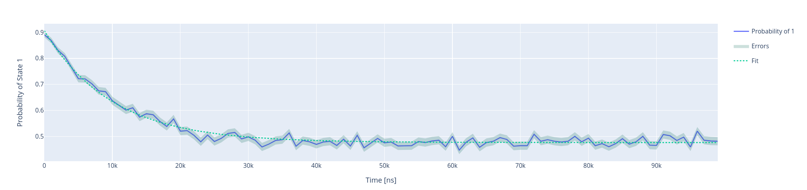
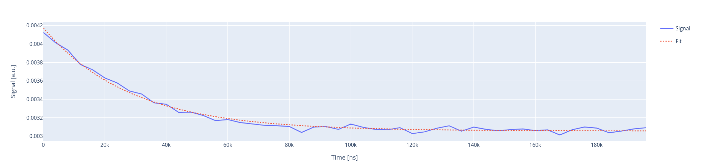

T2 experiments
==============

In this section we show how to run T2 experiments using Qibocal

T2
--

The acquisition for the :math:`T_2` experiment is the same one as for the ``Ramsey`` experiment,
the only difference is that in this experiment the drive pulse is not detuned. This protocol
is assuming that any error on the drive frequency has been already corrected through a ``Ramsey`` experiment.
For this reason we expect to see just an exponential behavior:

.. math::

    p_e(t) = A + B  e^{ - t / T_2}

The reason why there are two distinct experiment is that in order to correct the drive frequency
if the pulse is detuned enough we can proceed with short scans, while to extract reliably  :math:`T_2`
it will be necessary to perform longer scans.

Parameters
^^^^^^^^^^

.. autoclass:: qibocal.protocols.coherence.t2.T2Parameters
  :noindex:

Example
^^^^^^^

A possible runcard to launch a :math:`T_2` experiment could be the following:

.. code-block:: yaml

    - id: T2
      operation: t2
      parameters:
        delay_between_pulses_end: 100000
        delay_between_pulses_start: 4
        delay_between_pulses_step: 1000
        nshots: 1000

The expected output is the following:

:math:`T_2` is determined by fitting the output signal using
the formula presented above.

Requirements
^^^^^^^^^^^^

- :ref:`single-shot`

T2 with raw signal
------------------

A standard :math:`T_2` will try to compute the probability of the qubit
being measured in state :math:`\ket{1}`. It is possible to perform a :math:`T_2` experiment
without performing single shot calibration by running an experiment called ``t2_signal``.

The acquisition and the fitting procedure are exactly the same, the only difference being
that on the y axis it will be displayed the raw measurements from the instruments.

Parameters
^^^^^^^^^^

.. autoclass:: qibocal.protocols.coherence.t2_signal.T2SignalParameters
  :noindex:

Example
^^^^^^^

.. code-block:: yaml

    - id: T2 with signal
      operation: t2_signal
      parameters:
        delay_between_pulses_end: 200000
        delay_between_pulses_start: 4
        delay_between_pulses_step: 4000
        nshots: 5000
        relaxation_time: 300000

Note that in this case error bars will not be provided.

Requirements
^^^^^^^^^^^^

- :ref:`rabi`
