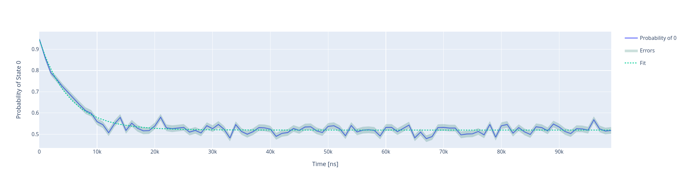
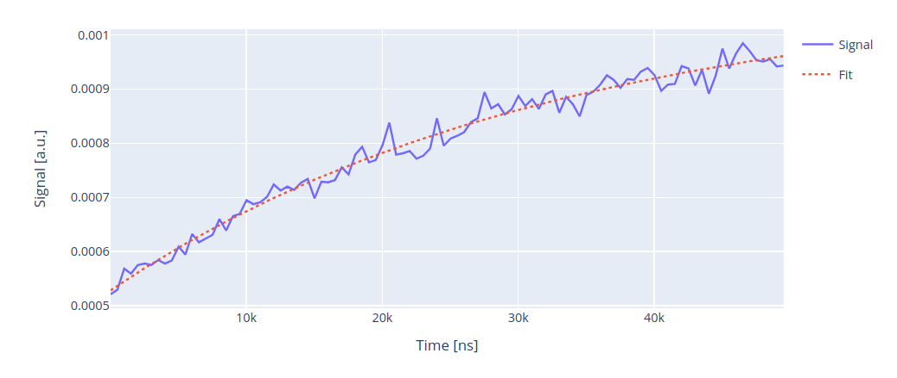

Hahn echo experiments
=====================

In this section we show how to run Hahn echo experiments using Qibocal

Spin-echo
---------

The acquisition for the :math:`T_2^{\text{Echo}}` experiment is similar to a ``Ramsey`` experiment,
with the difference that between the two :math:`\pi / 2` pulses we apply a :math:`\pi` pulse.
Such :math:`\pi` pulse is applied exactly at :math:`\tau / 2` where :math:`\tau` is the
waiting time between the two :math:`\pi / 2` pulses.

By applying this extra pulse we can mitigate the qubit dephasing :cite:p:`Krantz_2019, Chen2018MetrologyOQ` since any phase accumulated in
first half of the sequence will be reversed in the second half. This is also why usually :math:`T_2^{\text{Echo}} \ge T_2`.

The fit is again a dumped exponential of the following form:

.. math::

    p_e(t) = A + B  e^{ - t / T_2^{\text{Echo}}}

The reason why there are two distinct experiment is that in order to correct the drive frequency
if the pulse is detuned enough we can proceed with short scans, while to extract reliably  :math:`T_2`
it will be necessary to perform longer scans.

Parameters
^^^^^^^^^^

.. autoclass:: qibocal.protocols.coherence.spin_echo.SpinEchoParameters
  :noindex:

Example
^^^^^^^

A possible runcard to launch a :math:`T_2^{\text{Echo}}` experiment could be the following:

.. code-block:: yaml

    - id: T2 echo
      operation: spin_echo
      parameters:
        delay_between_pulses_end: 100000
        delay_between_pulses_start: 4
        delay_between_pulses_step: 1000
        nshots: 1000

The expected output is the following:

:math:`T_2^{\text{Echo}}` is determined by fitting the output signal using
the formula presented above.

Requirements
^^^^^^^^^^^^

- Single shot classification

Spin-echo with raw signal
-------------------------

A standard :math:`T_2^{\text{Echo}}` will try to compute the probability of the qubit
being measured in state :math:`\ket{1}`. It is possible to perform a :math:`T_2^{\text{Echo}}` experiment
without performing single shot calibration by running an experiment called ``spin_echo_signal``.

The acquisition and the fitting procedure are exactly the same, the only difference being
that on the y axis it will be displayed the raw measurements from the instruments.

Parameters
^^^^^^^^^^

.. autoclass:: qibocal.protocols.coherence.spin_echo_signal.SpinEchoSignalParameters
  :noindex:

Example
^^^^^^^

.. code-block:: yaml

    - id: Spin Echo with signal
      operation: spin_echo_signal
      parameters:
        delay_between_pulses_end: 200000
        delay_between_pulses_start: 4
        delay_between_pulses_step: 4000
        nshots: 5000
        relaxation_time: 300000

Note that in this case error bars will not be provided.

Requirements
^^^^^^^^^^^^

- Rabi signal
