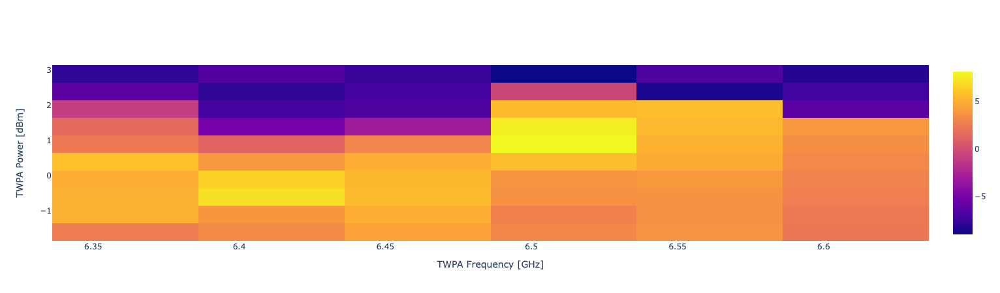

.. _twpa:

Calibration of TWPA
===================

In this section we show how to run an experiment aimed at calibrating the parameters
of an amplifier, which in most cases is going to be a TWPA.

In this experiment the pulse sequence consists in just a single readout pulse for each qubit.
We sweep the readout frequency and we acquire the signal. Firstly we acquire the signal
when the ampifier is off, then we repeat the same measurement by changing the frequency and
the power of the pump.

We then evaluate the gain for each frequency and power of the pump as :cite:p:`shin2024inoperandomicrowavescatteringparametercalibrated`

.. math::

    G(f, p) = 10 \log_{10} \Bigg( \frac{S_{on}(f, p)}{S_{off}} \Bigg)

where :math:`S_{on}(f,p)` is the signal acquired with the amplifier on and :math:`S_{off}`
the signal acquired with the amplifier off. The signal is defined as  :math:`S` as the average
magnitude of the signal for each readout frequency value.

The best point is then selected as the one with the maximum gain. Given that different qubits
often share the same amplifier, it could non trivial to select the best point.

Parameters
^^^^^^^^^^

.. autoclass:: qibocal.protocols.twpa.twpa.TwpaCalibrationParameters
  :noindex:

Example
^^^^^^^

A possible runcard to launch a TWPA calibration experiment could be the following:

.. code-block:: yaml

    - id: twpa_calibration
      operation: twpa_calibration
      parameters:
        freq_step: 10000000
        freq_width: 50000000
        nshots: 300
        twpa_freq_step: 50000000
        twpa_freq_width: 300000000
        twpa_pow_step: 0.5
        twpa_pow_width: 5

The expected output is the following:

