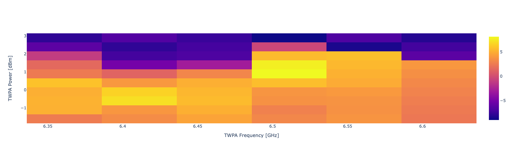

.. _twpa:

Calibration of TWPA
===================

In this section we show how to run an experiment aimed at calibrating the parameters
of an amplifier, which in most cases is going to be a TWPA.

In this experiment the pulse sequence consists in just a single readout pulse for each qubit.
We sweep the readout frequency and we acquire the signal. Firstly we acquire the signal
when the ampifier is off, then we repeat the same measurement by changing the frequency and
the power of the pump.

We then evaluate the gain for each frequency and power of the pump as :cite:p:`shin2024inoperandomicrowavescatteringparametercalibrated`

.. math::

    G(f, p) = 10 \log_{10} \Bigg( \frac{S_{on}(f, p)}{S_{off}} \Bigg)

where :math:`S_{on}(f,p)` is the signal acquired with the amplifier on and :math:`S_{off}`
the signal acquired with the amplifier off. The signal is defined as  :math:`S` as the average
magnitude of the signal for each readout frequency value.

The best point is then selected as the one with the maximum gain. Given that different qubits
often share the same amplifier, it could non trivial to select the best point.

Parameters
^^^^^^^^^^

.. autoclass:: qibocal.protocols.twpa.twpa.TwpaCalibrationParameters
  :noindex:

Example
^^^^^^^

A possible runcard to launch a TWPA calibration experiment could be the following:

.. code-block:: yaml

    - id: twpa_calibration
      operation: twpa_calibration
      parameters:
        freq_step: 10000000
        freq_width: 50000000
        nshots: 300
        twpa_freq_step: 50000000
        twpa_freq_width: 300000000
        twpa_pow_step: 0.5
        twpa_pow_width: 5

The expected output is the following:

TWPA Sweeper Protocol
---------------------

For instruments supporting hardware sweepers, the ``twpa_frequency_offset`` protocol
(aliased as ``twpa_sweep``) sweeps the TWPA pump frequency and amplitude (offset)
concurrently using an on-board 2D hardware sweep. Because hardware sweepers enforce
linear steps, the amplitude/power sweep is replaced by a linear offset sweep.

By default, when the ``probes`` parameter is omitted, the protocol performs only a
**single acquisition run** (a single execution for the reference scan, and a further
individual one for the 2D pump sweep). In this run, each target qubit is updated and
interrogated exclusively at its own calibrated readout resonator frequency, rather than
scanning across the readout frequencies of the other targets. This provides a fast,
multiplexed characterization at the operational frequencies of all selected targets.

When a discrete list of probe frequencies is provided in ``probes``, the protocol
instead evaluates each probe frequency in a loop, applying each frequency across all
target probe lines and averaging the resulting gain over the evaluated probes to find
the pump parameters that maximize average gain.

.. note::

    When defined, the probe frequencies are specified as a discrete list (``probes``) rather
    than a swept range, and evaluated via a software loop. The reason not to sweep the probe
    frequency continuously is that the TWPA gain oscillates rapidly with the probe frequency.
    Instead of obtaining the best gain on average across an arbitrary continuous range, the
    calibration is targeted specifically at the frequencies of the expected readout resonators.
    Because not all control electronics support sweeping an arbitrary non-equispaced list of values
    on-board, this is implemented as a loop over the probe frequencies, while the primary speed-up
    is achieved via the 2D hardware sweep over the pump signal parameters (amplitude and frequency).

Parameters
^^^^^^^^^^

.. autoclass:: qibocal.protocols.twpa.frequency_offset.TwpaFrequencyOffsetParameters
  :noindex:

Example
^^^^^^^

.. code-block:: yaml

    - id: twpa_frequency_offset
      operation: twpa_frequency_offset
      parameters:
        probes: [7000000000, 7200000000]
        frequency: ["center", 300000000, 50000000]
        amplitude: [0.1, 0.5, 0.05]
        nshots: 300
