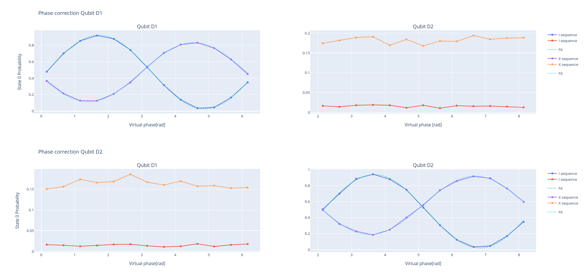

Virtual Z
=========

Parameters
^^^^^^^^^^

.. autoclass::
	qibocal.protocols.two_qubit_interaction.virtual_z_phases.VirtualZPhasesParameters
	:noindex:

Example
^^^^^^^

Below is an example runcard for this experiment.

.. code-block:: yaml

     - id: cz
       operation: cz_virtualz
       parameters:
        dt: 0
        flux_pulse_duration: 70
        theta_end: 6.5
        theta_start: 0
        theta_step: 0.5

The expected output is the following:

