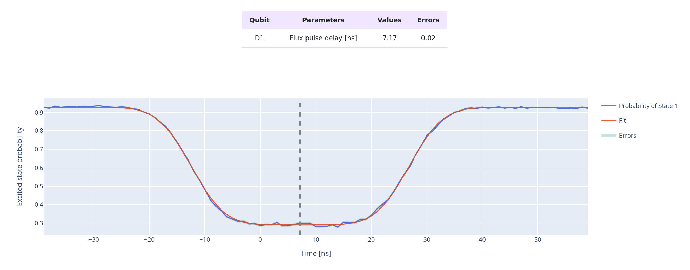

XYZ-TIMING
==========

This protocol is evaluating the different time of arrival of the flux and drive
pulse to the qubit. These delays are usually caused by differences in
cable length or by the electronics.

In this procedure, we vary the relative start times of the flux and drive pulses,
keeping their durations identical.
By measuring the probability of the qubit being in the excited state,
we identify the point where the two pulses arrive simultaneously.
At this point, the probability drops to zero because the qubit is off-resonance,
allowing us to determine the delay.

Parameters
^^^^^^^^^^

.. autoclass::
	qibocal.protocols.xyz_timing.XYZTimingParameters
	:noindex:

Example
^^^^^^^
It follows a runcard example of this experiment and the report.

.. code-block:: yaml

    - id: xyz_timing
      operation: xyz_timing
      parameters:
        delay_step: 1
        delay_stop: 100
        flux_amplitude: 0.3

