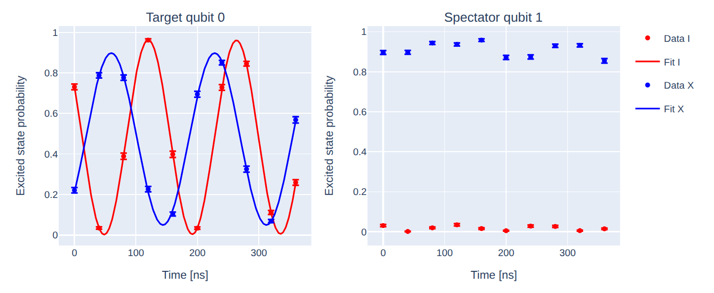
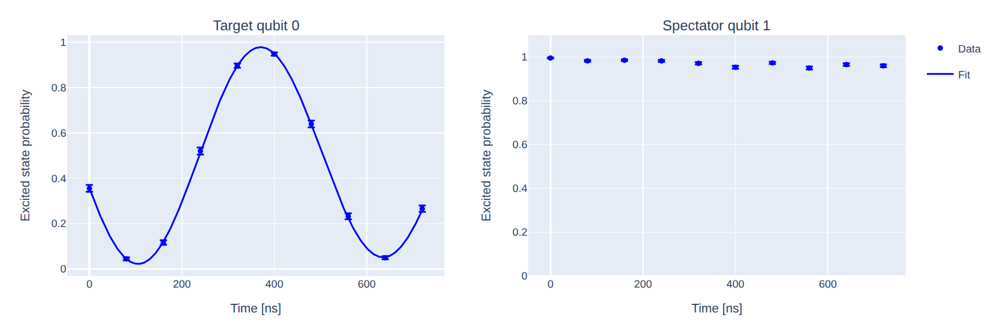

Residual ZZ Interaction
=======================

In superconducting transmon quantum processors, qubits are never perfectly isolated.
Even when no two-qubit gate is being executed, neighboring qubits experience weak
always-on interactions mediated by the coupling network. One of the most important
undesired interactions is the **residual ZZ coupling**, which produces a state-dependent
frequency shift.

For two coupled qubits, restricted to the computational subspace
:math:`\{|00\rangle, |01\rangle, |10\rangle, |11\rangle\}`, the
effective static Hamiltonian can generally be written as

.. math::

   H/\hbar = -\frac{\omega_0}{2} ZI
           - \frac{\omega_1}{2} IZ
           - \frac{\zeta}{4} ZZ,

where :math:`\zeta` is the residual ZZ interaction strength.

where :math:`\omega_1, \omega_2` are the (dressed) qubit frequencies
and :math:`\zeta` is the residual ZZ interaction rate.
In a simple three-level-per-qubit model, the ZZ rate can be
approximated in the **dispersive regime** as

.. math::

   \zeta_{ZZ} \approx \frac{2 g^2 \alpha_1 \alpha_2}
   {(\Delta_{12} - \alpha_1)(\Delta_{12} + \alpha_2)}

where :math:`\Delta_{12} = \omega_1 - \omega_2` is the qubit-qubit
detuning and :math:`\alpha_{1,2}` are the qubit anharmonicities and :math:`g` is the
**coupling strength**, which depends on the physical capacitance of the circuits.

The ZZ term shifts the transition frequency of one qubit depending on the state of
its neighbor:

.. math::

   \omega_\mathrm{target}^{(|1\rangle)}
   - \omega_\mathrm{target}^{(|0\rangle)}
   = \zeta.

Consequences include:

* coherent phase accumulation during idle periods;
* reduced gate fidelity;
* increased crosstalk;
* limitations on simultaneous gate execution.

Estimating Residual ZZ
----------------------

Two common characterization experiments are JAZZ and Ramsey ZZ.
Both experiments described below exploit the same basic idea: put one
qubit (the "spectator" or "control") in :math:`|0\rangle` or
:math:`|1\rangle`, and use a Ramsey-type measurement on the other
qubit (the "target") to detect the resulting frequency shift.

Ramsey ZZ (Conditional Ramsey)
------------------------------

Given that through a Ramsey experiment we can measure carefully the frequency of the qubit,
by repeating it while putting one of the neighbor qubits in
state :math:`\ket{1}` we can have an estimate on the ZZ coupling :math:`\zeta`.
For a more detailed discussion about Ramsey experiment see :ref:`ramsey`.

Parameters
^^^^^^^^^^

.. autoclass:: qibocal.protocols.zz_interaction.ramsey_zz.RamseyZZParameters
    :noindex:

Example
^^^^^^^

.. code-block:: yaml

    - id: ramsey zz
      operation: ramsey_zz
      parameters:
        delay_range: [10, 2000, 50]
        detuning: 0.0
        targets: [0, 1]

From :ref:`ramsey` we know that both signals oscillates according to

.. math::

   P_{|1\rangle}(t) = \frac{1}{2}\Big[1 + e^{-t/T_2^{*}}
   \cos\big(\Omega{c} \, t + \phi_0\big)\Big]

where :math:`\delta_c` is the target frequenncy conditioned on
the control state :math:`c \in \{0, 1\}`.
The residual ZZ rate is simply the difference between the two conditional fringe frequencies:

.. math::

   \zeta = \Omega_{1} - \Omega_{0}

JAZZ (Joint Amplification of ZZ)
---------------------------------------------------

JAZZ is an echo-based variant which combines a Ramsey-with-echo sequence on
**both** qubits simultaneously, hence mapping the ZZ-induced phase directly onto a single measured population,
rather than into two separately-fitted frequencies as in the experiment before.

Since the echo the :math:`\pi` pulse acts on both qubits together, ordinary single-qubit dephasing
and any **unconditional** frequency offset of the target refocus exactly as they would in a standard echo experiment (see :ref:`t2_echo`),
but the **conditional** ZZ-induced phase keeps accumulating over the entire duration :math:`2\tau` of the echo.
Finally a :math:`RY(\pi/2)` is applied to the target qubit and the signal is measured.

Parameters
^^^^^^^^^^

.. autoclass:: qibocal.protocols.zz_interaction.utils.ZZInteractionParameters
    :noindex:

Example
^^^^^^^

.. code-block:: yaml

    - id: jazz
      operation: jazz
      parameters:
        delay_range: [0, 800, 80]
        targets: [0, 1]

by sweeping the total free-evolution time it is possible to measure clean oscillations along the measurement axis according to:

.. math::

       P_{|1\rangle}(t) = \frac{1}{2}\Big[1 + e^{-t/T_{2echo}}
   \cos\big(\zeta \, t + \phi_0\big)\Big]

so :math:`\zeta` is equal to the frequency of the measured signal.

Requirements
^^^^^^^^^^^^

- :ref:`rabi`
- :ref:`ramsey`
